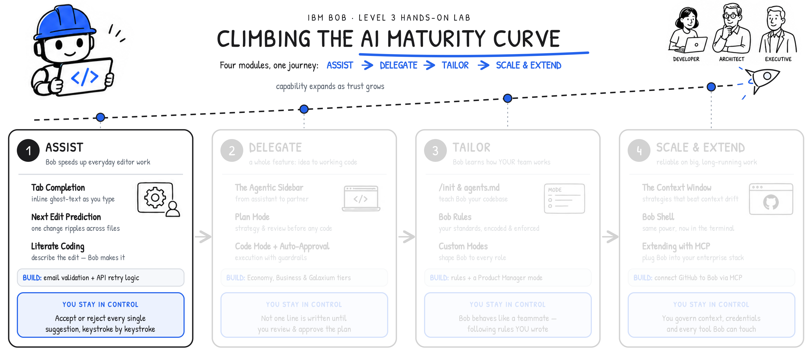

**MODULE 1 | ASSIST**
# **TAB COMPLETION & NEXT EDIT PREDICTION**

---

## **i. Bob in your workflow**

---

This is the first (and most gentle) stage of the **AI Maturity Curve**, and therefore a natural sweet spot for building your understanding of IBM Bob. Across this module, you'll work shoulder to shoulder with Bob from the perspective of a software developer paired with the Bob editor. As you work, Bob will be anticipating the next keystroke, drafting the next few lines, and making targeted edits upon your request — all the while keeping the developer (*you*) in control of accepting or rejecting every AI-generated proposed change.


    
!!! note ""
    The value that IBM Bob provides in climbing the **AI Maturity Curve** will be apparenty right from the onset: teams can move faster without breaking their train of thought, and nothing lands in the codebase that they did not explicitly choose to include. It is the most logical on-ramp to working with an AI partner, and it pays off from the very first session.

> **Watch first:** [Chapter 2.1: Next Edit Prediction and Tab Completion \[IBM Bob L3\]](https://ibm.seismic.com/Link/Content/DCjDg6FMhPF2Q8CWfg2qf4jbmCh8)
>
> Maximilian Jesch *(Outbound Product Manager — IBM Bob)* demonstrates Bob's tab completion and next edit predictions. *\[1 min\]*

---

## **ii. Why this matters**

---

The quickest way to lose a developer's confidence in an AI tool is to pull them out of their workflow.

Bob's first two capabilities are designed to do precisely the opposite: it keeps a developer *in* the work, while quietly removing friction from the process. These two features are:

1. **Tab completion**
2. **Next edit prediction**

The two capabilities operate as a unified pair: the first suggests code from context; the second anticipates where you will need to go next.

---

**How tab completion works**

Tab completion is a familiar idea executed unusually well. Where conventional autocomplete reacts to the few characters you have just typed, Bob reads the surrounding context to make a genuinely informed suggestion — drawing on the comments describing your intent, the patterns and structure already present in the code, your project's conventions and style, and related code in other files. The result feels less like word-completion and more like a colleague finishing your thought.

---

**Accepting suggestions**

When Bob offers a suggestion, the human in the loop retains control and has the last word on what is implemented:

- Press **Tab** to accept it
- Keep typing to override the AI-generated suggestions
- Watch it update dynamically as you continue your train of thought

---

**Next edit predictions**

Real code changes are rarely confined to a single line within the codebase. Add a new field or variable to the code, and you'll oftentime find yourself needing to use it again elsewhere; introduce a function, and something downstream will need to call it. **Next edit prediction** is built around that practical reality: after you accept an AI-generated suggestion, Bob anticipates the *related* edit you are likely to need as a follow-up and moves you there.

You can conceptualize this as a *rhythm* between the developer and their AI partner. The developer describes what they want in a comment, allows Bob to suggest the code fix, presses **Tab** to accept the suggestion, and presses **Tab** again to jump to the next predicted location — where Bob positions the cursor exactly where the new code needs to be invoked.

---

## **iii. Hands-on: adding email validation with Next Edit Prediction**

---

> **Follow the video** for a full walkthrough of this scenario: [Chapter 2.1: Next Edit Prediction and Tab Completion \[IBM Bob L3\]](https://ibm.seismic.com/Link/Content/DCjDg6FMhPF2Q8CWfg2qf4jbmCh8)

!!! warning "**EXPECT SOME VARIABILITY**"
    
    Generative AI is *non-deterministic* and as such your results may differ from what you see here. If an output diverges, consider further refining the prompt, following up with another prompt, or adjusting the code by hand. Iteration and further precision are often the best remedies.

Let's begin by adding to *Galaxium Travels*' set of capabilities a new feature that's currently missing: validation of email addresses that a user types when they sign in.

---

1. In the Visual Studio Code (VS Code) activity bar, click **Explorer**.

    <p align="left">
    
    </p>

---

2. Click **Open Folder**.

    <p align="left">
    
    </p>

---

3. From the *File Explorer* view, highlight the `galaxium-travels` folder and select the folder.

    <p align="left">
    
    </p>

---

4. Drill down into `galaxium-travels` folder contents and locate the **UserIdentification.tsx** file. It will be nestled inside the following directory hierarchy:

    !!! warning "**Filepath:**"
        **/**`booking_system_frontend`**/**`src`**/**`components`**/**`user`**/**`UserIdentification.tsx`

    <p align="left">
    
    </p>

---

5. Double-click on `UserIdentification.tsx` to open the contents within the IDE.

    <p align="left">
    
    </p>

---

6. Navigate to the `UserIdentification` function (**line 19** of `UserIdentification.tsx`).

    <p align="left">
    
    </p>

---

7. In order to demonstrate IBM Bob's ability to generate functional application code based on basic, natural language specifications, we'll begin with a simple one-liner comment that describes the work we'd like the application to perform. In this example, that will be validation of email addresses to ensure that users signing up for the Galaxium service are supplying compliant email addresses that follow the expected formatting.

    Begin by moving the cursor to **line 19** of the file (within the `UserIdentification` function) and type the following, including the forward-slash (`/`) characters:

    ```

    //validate email addresses

    ```

    Then add a blank (empty) line *before* and *after* this commented line. The result should appear as the following:


    === "UserIdentification.tsx"

        ``` tsx linenums="17" hl_lines="3 4 5"
        const [isLoading, setIsLoading] = useState(false);
        const [isNewUser, setIsNewUser] = useState(false);

        //validate email addresses

        const handleSubmit = async (e: React.FormEvent) => {
            e.preventDefaut();
        }
        ```

    <p align="left">
    
    </p>

---

8. Move your cursor to the **end** of the newly-created `//validate email addresses` comment on **line 19**, then press ++enter++ followed by ++tab++ to invoke Bob's *Tab Completion* feature.

    <p align="left">
    
    </p>

    **Tab Completion** will immediately insert greyed-out, italicized text — this represents the AI-suggested code completion based on the natural language "validate email addresses" comment.
    
    At this stage, the code suggestion is still *only* a suggestion: you, as the operator at the helm, have the option to: accept; modify; or reject and move on.


---

9. Press the ++tab++ key once again to **accept** the suggested code. Note that the grey italics are replaced by *normal* characters after accepting the suggestion. This denotes that the AI-suggested code has been committed to your file as working code.

    <p align="left">
    
    </p>

    As a reminder, because Bob's suggestions are non-deterministic, your generated function may look slightly different from the code documented. If the generated code does not compile, first compare the inserted function with the example shown in the lab documentation.
    
    You may either manually correct the function by hand to make the documented solution, or delete the generated code and repeat the prediction step (using ++tab++ as before) again.

---

10. Now let's return to the Galaxium Travels web app and confirm the change took effect. To do so, you will first need to reboot the web app service.

    - To open a Terminal window, click the **Terminal** button at the bottom-center portion of the Bob IDE interface *or* navigate using the top menu bar into **Terminal** > **New Terminal** (which will open a fresh Terminal screen at the bottom-center portion of the UI).
    - Within the Terminal window, locate and click the **+** icon, along the right-hand side of the Terminal window. This will launch a new Terminal connection into which you will next input additional commands.

    <p align="left">
    
    </p>

---

11. The commands to be issued to the Terminal console depending on the operating system your machine is running upon.

    From the expandable options below, follow and execute the instructions aligned to your machine's OS (either Mac/Linux or Windows). After completing the instructions within the appropriate tab, proceed to the next step in the lab guide.

    ??? quote "MAC OR LINUX"

        On macOS or Linux, run the following commands one at a time.

        **Step 1:**
        ``` bash
        cd \~/galaxium-travels
        ```
        
        **Step 2:**
        ``` bash
        ./start.sh
        ```
        
        You should see a *"Galaxium Travels is running!"* prompt returned to the console (amongst other messages) once the application has deployed successfully.

        </br>
        <p align="left">
        
        </p>

    ??? quote "WINDOWS OS"

        On Windows, run the following commands one at a time.

        **Step 1:**
        ``` bash
        cd $HOME\galaxium-travels

        ```

        **Step 2:**
        ``` bash
        cd booking_system_backend

        ```

        **Step 3:**
        ``` bash
        python -m venv .venv

        ```

        **Step 4:**
        ``` bash
        .venv\Scripts\activate

        ```

        **Step 5:**
        ``` bash
        python server.py

        ```

        !!! warning "DO NOT CLOSE THE TERMINAL WINDOW"

            For the following **Steps 6-9**, you will be required to open a second Terminal window. **Do not** close the Terminal previously used for **Steps 1-5**. This window will need to remain open and active for the duration of the lab.
        
        **Step 6:**
        After having completed all of **Steps 1-5**, open a new Terminal window by pressing the **Plus** button.

        <p align="left">
        
        </p>

        <p align="left">
        
        </p>

        **Step 7:**
        Within the new Terminal window, execute the following commands one-by-one in sequence:

        ```
        cd $HOME\galaxium-travels

        ```

        **Step 8:**
        ```
        cd booking_system_frontend

        ```

        **Step 9:**
        ```
        npm run dev

        ```

        <p align="left">
        
        </p>

        You should see a *"Galaxium Travels is running!"* prompt returned to the console (amongst other messages) once the application has deployed successfully.

---

12. Open a web browser on your local machine and visit the following URL to access the Galaxium Travels application:

    !!! warning "WEB BROWSER"
        http://localhost:5173/

    <p align="left">
    
    </p>

---

13. Once the Galaxium Travels site has loaded, click on **Flights**.

    <p align="left">
    
    </p>

---

14. Click the **Book Now** button under any of the listed flights to test its functionality.

    <p align="left">
    
    </p>

---

15. The web page will redirect to a **Sign In** panel. From this panel, we will be able to confirm (or troubleshoot) that the Bob-suggested email validation functionality is performing its intended job.

    - Within the *Name* field, supply a name of your choosing.
    - Within the *Email* field, try any combination of **improperly** formatted text that you like. Remember: you want to test that the tool is rejecting any inputs that don't match a standard email address. You can even test with a random string of characters like `$$$$$`, as an example.
    - The expected behavior of the function should be to reject any inproper addresses (`$$$$$`) and accept a standard address (`bienko@ibm.com`).
    
    </br>

    <p align="left">
    
    </p>

    <p align="left">
    
    </p>

    <p align="left">
    
    </p>