**MODULE 2 | DELEGATE**
# **APPLYING AGENTIC MODES**

---

## **i. Why this matters**

---

It's now time to apply the full **Plan → review → new conversation → Agent** workflow towards a set of Galaxium Travels features that cut across the frontend, the backend, and the database of the application. A truly comprehensive cross-section of the application architecture will need to be modified — and thankfully, IBM Bob is up to the challenge.

You are going to give Galaxium Travels end-users three *tiers* of seating options to select from with booking their extraplanetary tours: **Economy, Business, and Galaxium class.** Throughout this process, take note of two things: first, the increased weighting placed on IBM Bob for *execution* of the requested tasks; and second, the heightened importance for the user (you) in *understanding and reviewing the plan of action* that Bob's agentic AI processes will act upon.

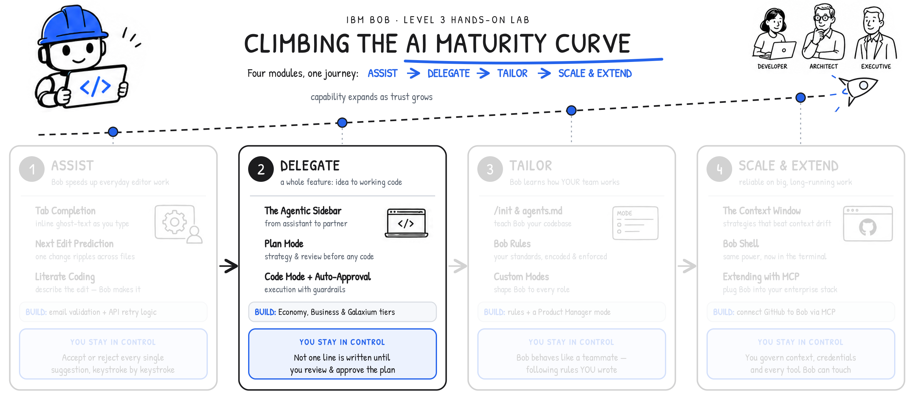

!!! note ""
    This mirrors where you are along your journeing in shifting right along the **AI Maturity Curve**. By the **Delegate** phase, your trust in the capacity of these AI systems to carry out work as asked will have increased from the nascent **Assist** entrypoint. Nevertheless, human-in-the-loop review and unambiguous execution plans remain of paramount importance as planned jobs become more automated (and sophisticated.)

## **ii. Hands-on: Scoping work for Galaxium Travels modifications (Plan Mode)**

---

1. As discussed already, the **Agentic Sidebar** is Bob's most capable interface: the place it can read files, reason across the whole codebase, ask clarifying questions, and implement a new feature end-to-end.

    You will use multiple modes when creating new features in the Galaxium Travels application. Each mode is designed for a specific phase of development. Let's put it to work adding seat classes to Galaxium Travels.

    - Begin, as always, by *planning*: letting Bob draft the implementation plan with us before any code is written
    - Near the bottom of the agentic sidebar, expand the mode pop-up by pressing the **Mode** toggle
    
    !!! quote "HOW TO: OPEN THE AGENTIC SIDEBAR"
        If the Agentic Sidebar is not automatically open within the Bob IDE, or if you close it and need to re-open the panel, click the **Open Bob** icon located to the right of the search bar in the top-center portion of the interface.
        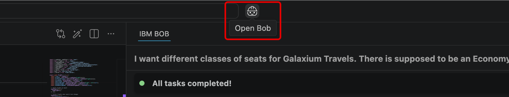
    !!! quote "HOW TO: SWITCH BETWEEN DIFFERENT AGENTIC MODES"
        The label assigned to the **Mode toggle** button will change to reflect the name of the mode that the Agentic Sidebar currently has active. For example, if in the *Agent* mode, the toggle button will read as *Agent*. For the sake of clarity, when instructing you to change the Agentic Mode type, this documentation will refer to this toggle button as the **Mode toggle**.
        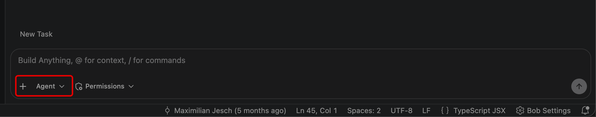

---

2. Bob's modes tailor its level (and forms of) assistance to the task at hand: planning, implementing, debugging, or learning.

    Click on **Plan** from the selected of *Modes* inside the agentic sidebar panel.
    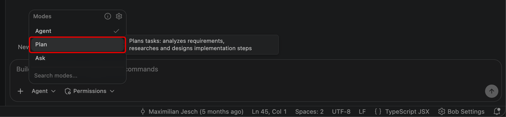

---

3. The IDE will automatically engage **Plan** mode, which can be confirmed by inspecting the bottom of the screen.

    Next, you will need to determine the level of autonomy granted to the mode's ability to perform tasks with (or without) human input. Click the **Permissions** toggle to expose these details.

    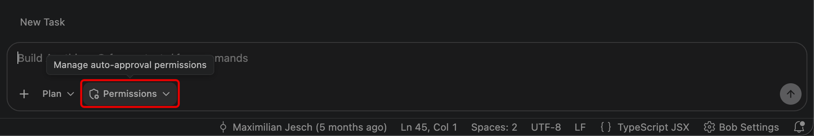

---

4. For now, allow every action to be executed by Bob automatically by **toggling on** (checking) *all* available options within the panel.

    Click anywhere else within the Agentic Sidebar to save & close the toggle options.

    !!! warning ""
        **For real-world projects**, set auto-approval deliberately, according to how much control you're willing to delegate directly over to Bob.
    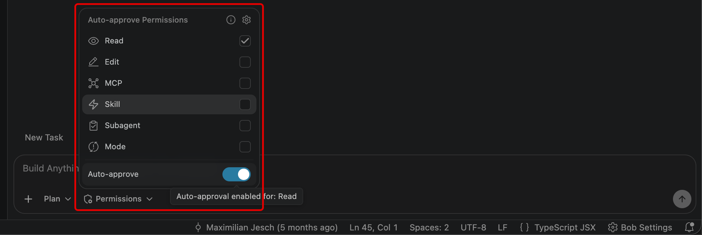
    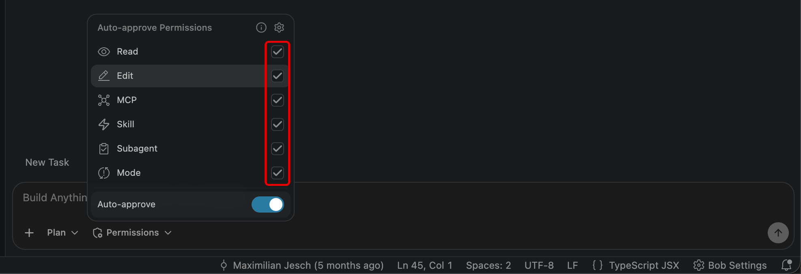

---

5. With **Plan mode** active and auto-approval enabled, **copy and paste** the following task into the Agentic Sidebar session window:

    ```
    I want different classes of seats for Galaxium Travels.
    There is supposed to be an Economy class, a Business class, and a Galaxium class.
    Help me make a plan to implement this.
    ```
    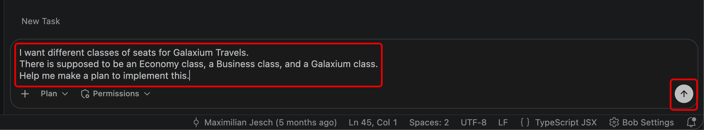

---

6. With the prompt entered, hit ++return++ or press the **Send** button to the right of the chat interface.

    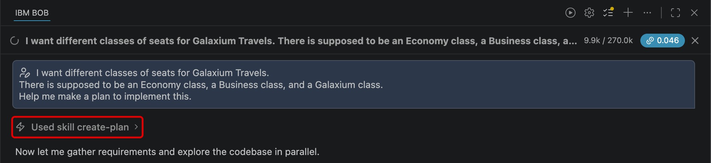

---

7. Bob will first execute the `create-plan` **Skill** and begin to research the codebase to understand the existing structure, before asking clarifying questions of the user (you).

---

!!! warning "ATTENTION: NON-DETERMINISTIC WORK AHEAD"
    Bob's responses are **non-deterministic**, so questions posed to you within your Bob IDE may differ from those shown here. It's also possible you may receive no clarifying questions at all.

    IBM Bob is powered by generative AI and LLMs, and a defining trait of these systems is that they are *non-deterministic* — unlike the *deterministic* tools most developers are accustomed to. In practice, that means the same prompt can produce different code from one run to the next. This is both a strength and a quirk of the technology, and it is something to work *with* rather than against.

    **All this is to say: *Your results ahead may vary.*** The key takeaway from these workflows is that you understand how to effectively utilize each of Bob's Modes and where their strengths are best applied. Whether or not you arrive at the exact same codebase at the end is of less importance. Bob will ensure either way that your application works and delivers more-or-less what you asked for. The exact implementation and steps that Bob takes to arrive at that result, however, may differ from the steps documented here.

8. The first point of clarification asked for by Bob: *Should the three seat classes (Economy, Business, Galaxium) have different pricing, and if so, how should prices be calculated — a fixed price per class per flight, or a multiplier on the base flight price?*

    - This questioning is accompanied by three recommended (and click-able) responses
    - You can always enter your own response at the bottom of the chat session, as well
    - Select the ***"Use a multiplier on the base price (e.g. Economy = 1x, Business = 1.5x, Galaxium = 2.5x)"*** option to construct a range of seat classes with varying associated price rates

---

9. A second follow-up question: *"Should each seat class have its own separate seat availability count per flight (e.g. 10 economy seats, 5 business seats, 2 Galaxium seats), or should all classes draw from one shared pool of seats?"*

    Select the ***"Each class has its own seat count per flight (separate availability tracking per class)"*** option.

---

10. A third follow-up question: *"Where in the UI should the user choose their seat class? Should they pick it when browsing flights (on the FlightCard), or when they confirm the booking (inside the BookingModal)?"*

    Select the ***"In the BookingModal — the user picks a class as part of confirming the booking"*** option.

---

11. A fourth follow-up question: *"Should the booked seat class be visible in the user's booking history (MyBookings page and BookingCard)?"*

    Select the ***"Yes — show the seat class on each booking in the history"*** option.

---

12. A fifth follow-up question: *"Should the FlightCard display per-class seat availability (e.g. "Economy: 8 seats, Business: 4 seats, Galaxium: 2 seats"), or just show the lowest/most relevant availability as it does now?"*

    Select the ***"Show per-class availability on the FlightCard (e.g. a small breakdown for each class)"*** option.

---

**WRAPPING UP THE PLAN PHASE**

Bob will then confirm it has all the clarifying details it requires of the user, and will begin carrying on the remainder of the work. It begins by exploring the various directories and files of the project in order to understand the full picture of the front-end and back-end components.

!!! note ""
    Recall that IBM Bob's *Plan Mode* is a **read-only** mode. It is intended for design tasks, architecture analysis, technical specifications, and breaking down problems into sequential workflows — all performed **without** making any code changes.

Bob will potentially follow-up the summary of the *Plan Mode* actions with **additional clarifying questions**, which you can answer or **ignore** for now (recommended).

!!! note ""
    Bob can generate one or more Markdown (`.md`) plan files, with various potential names that will be specific to *your* project. For example, Bob might generate Markdown files such as `SEAT_CLASSES_IMPLEMENTATION_PLAN.md`, `implementation-checklist.md`, `seat-classes-architecture.md`, or `seat-classes-implementation-plan.md`.

The plan includes a complete summary of proposed changes to the application stack, including:

- Database
- Backend service
- API schema
- Frontend types
- UI components

Additionally, the Plan Mode outlines the **key decisions baked into the plan** itself: pricing, seat availability, where Class is chosen, FlightCard display, DB migration, and more.

---

## **iii. Hands-on: Implementing seat class changes (Agent Mode)**

---

Once the implementation plan document(s) appear, the **Plan mode** phase is essentially complete. Inspect and review the plans that Bob has created based on your requested workflow. Bob will have generated a `seat-classes-plan.md` Markdown file which can be inspected in-line within the chat session, or double-clicked to open within the Bob IDE editor (center panel).

!!! warning "ATTENTION: NON-DETERMINISTIC WORK AHEAD"
    Bob's responses are **non-deterministic**, so questions posed to you within your Bob IDE may differ from those shown here. It's also possible you may receive no clarifying questions at all.

    IBM Bob is powered by generative AI and LLMs, and a defining trait of these systems is that they are *non-deterministic* — unlike the *deterministic* tools most developers are accustomed to. In practice, that means the same prompt can produce different code from one run to the next. This is both a strength and a quirk of the technology, and it is something to work *with* rather than against.

    **All this is to say: *Your results ahead may vary.*** The key takeaway from these workflows is that you understand how to effectively utilize each of Bob's Modes and where their strengths are best applied. Whether or not you arrive at the exact same codebase at the end is of less importance. Bob will ensure either way that your application works and delivers more-or-less what you asked for. The exact implementation and steps that Bob takes to arrive at that result, however, may differ from the steps documented here.

1. When ready to move from *planning* (**Plan mode**) to *implementation* (**Agent mode**), copy and paste the following statement into the chat window and press ++return++ to execute:

    ```
    The plan looks great.
    Let's switch to Agent mode and start implementing the seat classes.
    ```
    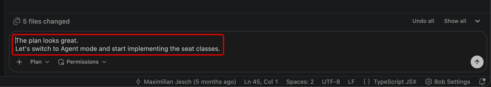

---

2. Bob will automatically switch into **Agent mode** at your request, which you can visually confirm by looking at the **Mode toggle** button and also see expressed in written form within the Agentic Sidebar chat window.

    ??? quote "HOW TO TOGGLE DIFFERENT AGENTIC MODES"
        The label assigned to the **Mode toggle** button will change to reflect the name of the mode that the Agentic Sidebar currently has active. For example, if in the *Agent* mode, the toggle button will read as *Agent*. For the sake of clarity, when instructing you to change the Agentic Mode type, this documentation will refer to this toggle button as the **Mode toggle**.
    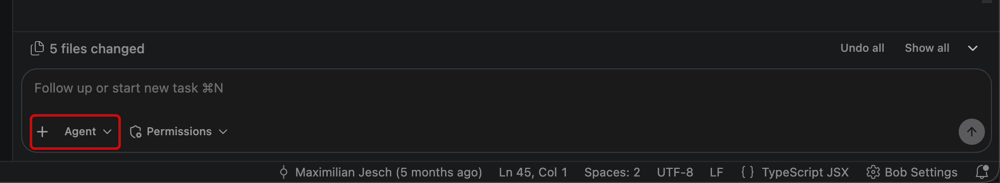
    !!! note "CHANGES AWAITING APPROVAL"
        You may have noticed that with the change to Agent mode, Bob is once again providing more permission "checkpoints" in the process — asking for your direct approval of actions before carrying them out, keeping you in control of the process. If you had set the previous Plan mode permissions to auto-approval (which this lab guide had recommended), this will be particularly evident. This is partly because of the switch within the Agentic Sidebar *Mode* from Plan to Agent — previous permission settings that were applied to Plan mode do not carry over automatically (by design) to Agent mode. However, this is also owing to the need for greater scrutiny and permissions-awareness when graduating from a *read-only* agent (Plan) to an agent with *write and execute* capabilities (Agent).

3. Once Bob has activated Agent mode, it will generate an *Update Todo List* with the following (or similar) sub-tasks:

| TASK | OBJECTIVES |
| ---- | ---------- |
| **Sub-Task 1** | Extend the backend data model (`models.py`, `seed.py`) |
| **Sub-Task 2** | Update backend schemas and booking service (`schemas.py`, `services/booking.py`, `server.py`) |
| **Sub-Task 3** | Update frontend types and API service (`types/index.ts`, `utils/seatClasses.ts`, `services/api.ts`) |
| **Sub-Task 4** | Add seat class selector to `BookingModal` |
| **Sub-Task 5** | Update `FlightCard` to show per-class availability |
| **Sub-Task 6** | Show seat class in booking history (`BookingCard.tsx`) |

---

**SEQUENCING THE SUB-TASKS**

In the steps ahead, you will examine in detail what each *Sub-Task* is performing and understand the rationale for the change. With your approval, Bob will then go ahead and implement the work on your behalf.

!!! tip "Sub-Task 1: Extend the backend data model (models.py, seed.py)"
    The current database schema stores a single integer `seats_available` on the `Flight` table, which treats all seats as interchangeable. To support three distinct seat classes, we need to split this into three independent columns — `economy_seats`, `business_seats`, and `galaxium_seats` — each tracking its own count. This is a deliberate database design choice: storing them as separate columns (rather than a related table) keeps queries simple, since we always need all three counts together and they have a fixed, known set.

    On the `Booking` side, we add a `seat_class` string column so every booking permanently records which class was reserved. This is critical for the cancel flow — when a booking is cancelled, the system needs to know which column to increment back.

    In `models.py` we swap out the old `seats_available` column for the three new ones on the `Flight` ORM class, and add `seat_class` to `Booking`.

    In `seed.py` we update all 10 demo flight records to use the new column names with realistic space-travel seat counts (Economy: 5–10, Business: 3–5, Galaxium: 1–2), and update the 20 demo bookings to each include a randomly assigned `seat_class`. Because the app uses SQLite and recreates the schema from scratch on every server start via `init_db` + `seed`, no migration tooling is needed — the old `booking.db` is simply dropped and rebuilt.

4. Within the Agentic Sidebar, you will be prompted with the following: *`Ready to implement Sub-Task 1. Shall I go ahead?`*

    If you agree with the changes, type `Yes` and ++return++ to approve **Sub-Task 1** execution.

---

5. Continue approving any additional requests related to Sub-Task 1 until the Agentic Sidebar chat has reported back with a summary of *`Sub-Task 1 is done. Here's what has changed.`*
    
    !!! quote ""
        - `models.py`: seats_available replaced with `economy_seats`, `business_seats`, `galaxium_seats` on `Flight`; `seat_class` added to `Booking`
        - `seed.py`: All 10 demo flights now carry per-class seat counts. The booking loop picks a random `seat_class` for each of the 20 demo bookings

!!! tip "Sub-Task 2: Update backend schemas and booking service (schemas.py, services/booking.py, server.py)"
    The database model is now correct, but the three layers above it — Pydantic schemas, the booking service, and the FastAPI/MCP server — still reference the old `seats_available` field and know nothing about `seat_class`. This sub-task threads the new fields all the way up to the API boundary.

    In `schemas.py` we swap `seats_available` for the three new seat fields on `FlightOut` (so the API response carries per-class counts), and add seat_class to both `BookingRequest` (what the client sends) and `BookingOut` (what the server returns).

    In `services/booking.py` we update `book_flight` to accept `seat_class`, validate it against the three allowed values, look up the correct column (using a small `SEAT_CLASS_MAP` dict), check that class has seats, decrement only that column, and store `seat_class` on the new `Booking` record. We also update `cancel_booking` to read the booking's `seat_class` and increment the matching column — without this, cancellations would silently not restore the right class's count.

    In `server.py` we pass `request.seat_class` through to the service on the REST endpoint, and add `seat_class: str` to the MCP tool signature so AI agents can also book with a class.

6. Within the Agentic Sidebar, you will be prompted with the following: *`Ready to implement Sub-Task 2. Shall I go ahead?`*

    If you agree with the changes, type `Yes` and ++return++ to approve **Sub-Task 2** execution.

---

7. Continue approving any additional requests related to Sub-Task 2 until the Agentic Sidebar chat has reported back with a summary of *`Sub-Task 2 is done. Here's what has changed.`*
    
    !!! quote ""
        - `schemas.py`: `FlightOut` now exposes `economy_seats`, `business_seats`, `galaxium_seats`; `BookingRequest` and `BookingOut` both carry `seat_class`
        - `services/booking.py`: `book_flight` now accepts `seat_class`, validates it against `VALID_SEAT_CLASSES`, checks the right column for availability, decrements that column, and stores `seat_class` on the booking. `cancel_booking` uses `SEAT_CLASS_MAP` to restore the correct column
        - `server.py`: Both the REST endpoint and MCP tool pass `seat_class` through to the service. The MCP docstring is updated to document the new parameter

!!! tip "Sub-Task 3: Update frontend types and API service (types/index.ts, utils/seatClasses.ts, services/api.ts)"
    The backend now speaks a new contract — three seat columns on flights, `seat_class` on bookings — but the frontend's TypeScript types still describe the old world. Until we fix that, every component that references flight.`seats_available` or `booking.seat_class` will have a type error, and nothing will compile correctly.

    In `types/index.ts` we replace `seats_available`: number with `economy_seats`, `business_seats`, and `galaxium_seats` on the `Flight` interface, and add `seat_class` to both `Booking` and `BookingRequest`. This makes the type system enforce the new shape everywhere downstream — any component that hasn't been updated yet will immediately surface a compile error rather than a silent runtime bug.

    We then create a brand-new utility file, `utils/seatClasses.ts`. This file is the single source of truth for all seat-class logic on the frontend: the `SeatClass` type alias, human-readable labels (`SEAT_CLASS_LABELS`), price multipliers (`SEAT_CLASS_MULTIPLIERS`), an ordered array (`SEAT_CLASSES`) for rendering options in a consistent sequence, and a `getSeatClassPrice(basePrice, seatClass)` helper that applies the multiplier. Centralising this means Sub-Tasks 4, 5, and 6 all import from one place — there's no risk of the multipliers drifting out of sync between components.

    Finally, we verify `services/api.ts` — the `bookFlight` call already spreads the full `BookingRequest` object into the POST body, so once `BookingRequest` gains `seat_class` in the type definition, the API call will automatically include it with no code change needed.

8. Within the Agentic Sidebar, you will be prompted with the following: *`Ready to implement Sub-Task 3. Shall I go ahead?`*

    If you agree with the changes, type `Yes` and ++return++ to approve **Sub-Task 3** execution.

---

9. Continue approving any additional requests related to Sub-Task 3 until the Agentic Sidebar chat has reported back with a summary of *`Sub-Task 3 is done. Here's what has changed.`*
    
    !!! quote ""
        - `types/index.ts`: Flight now has `economy_seats`, `business_seats`, `galaxium_seats` instead of `seats_available`. `Booking` and `BookingRequest` both carry `seat_class` as a typed literal union
        - `utils/seatClasses.ts`: New utility file — the single source of truth for all seat-class logic. Exports `SeatClass` type, `SEAT_CLASSES` ordering array, `SEAT_CLASS_LABELS`, `SEAT_CLASS_MULTIPLIERS`, `getSeatClassPrice()`, and `getSeatCount()`
        - `services/api.ts`: No changes needed — `bookFlight` already posts the full `BookingRequest` object, so `seat_class` will flow through automatically now that the type is updated

!!! tip "Sub-Task 4: Add seat class selector to BookingModal"
    This is the core user-facing change. Right now the `BookingModal` shows a static price and a single "Confirm Booking" button — there's no concept of class. We need to insert a class selector so the user can choose Economy, Business, or Galaxium before confirming.

    We'll add a `selectedClass` state variable (defaulting to `'economy'`) and render three clickable option cards — one per class — in a "Select Seat Class" section above the price summary. Each card shows the class label, the number of seats remaining for that class (pulled from `flight.economy_seats` etc.), and the calculated price using `getSeatClassPrice`. Cards where that class has 0 seats will be visually dimmed and pointer-events disabled so they can't be selected. The "Total Price" display will reactively update as the user switches class. When the user hits "Confirm Booking", the `bookFlight` call will include `seat_class: selectedClass`.

    The default selection logic also needs one nuance: if Economy is sold out on open, we should default to the first available class rather than leaving the user on a disabled option. We'll handle this with a `useMemo` that picks the first class with seats when the modal opens.

10. Within the Agentic Sidebar, you will be prompted with the following: *`Ready to implement Sub-Task 4. Shall I go ahead?`*

    If you agree with the changes, type `Yes` and ++return++ to approve **Sub-Task 4** execution.

---

11. Continue approving any additional requests related to Sub-Task 4 until the Agentic Sidebar chat has reported back with a summary of *`Sub-Task 4 is done. Here's what has changed.`*
    
    !!! quote ""
        - The following changes were implemented within `BookingModal.tsx`
        - Imports `useMemo`, `SEAT_CLASSES`, `SEAT_CLASS_LABELS`, `getSeatClassPrice`, `getSeatCount`, and the `SeatClass` type from the new utility
        - A `defaultClass` memo picks the first class with seats when the flight changes (falls back to `'economy'`)
        - `selectedClass` state drives the UI, and resets whenever a new flight is passed in
        - A new **"Select Seat Class"** section renders three buttons — each showing the label, seat count, and per-class price Zero-seat options are dimmed and disabled
        - The **Total Price** banner now shows `getSeatClassPrice(flight.price, selectedClass)` so it updates in real time as the user toggles
        - The `bookFlight` call includes `seat_class: selectedClass`

!!! tip "Sub-Task 5: Update FlightCard to show per-class availability"
    The `FlightCard` is currently built around a single `seats_available` field that no longer exists on the `Flight` type — so right now it would fail to compile. We need to replace it with a compact three-row breakdown showing how many seats each class has on that flight.

    The key design decisions here are: (1) "Sold Out" should only apply when all *three* classes are at zero, not just one; (2) the low-seat warning (the `solar-orange` colour) should apply per-class so users can see at a glance when a particular class is nearly full; and (3) the displayed price should gain a "from" label, since the actual price depends on the class selected during booking.

    We'll import `SEAT_CLASSES`, `SEAT_CLASS_LABELS`, and `getSeatClassPrice` from `utils/seatClasses.ts` and render the availability rows as a small loop rather than hardcoding each one, keeping the component clean.

12. Within the Agentic Sidebar, you will be prompted with the following: *`Ready to implement Sub-Task 5. Shall I go ahead?`*

    If you agree with the changes, type `Yes` and ++return++ to approve **Sub-Task 5** execution.

---

13. Continue approving any additional requests related to Sub-Task 5 until the Agentic Sidebar chat has reported back with a summary of *`Sub-Task 5 is done. Here's what has changed.`*
    
    !!! quote ""
        - The following changes were implemented within `FlightCard.tsx`
        - Imports `SEAT_CLASSES`, `SEAT_CLASS_LABELS`, `getSeatClassPrice`, and `getSeatCount` from `utils/seatClasses.ts`
        - `isLowSeats/isSoldOut` based on the old `seats_available` field removed, `isSoldOut` now only triggers when all three class counts are zero
        - The price label changes from "per seat" to **"from"**, since Economy is always the lowest multiplier (1×), the displayed base price is the true minimum
        - The single seats row is replaced by a three-row loop— one per class —with per-class low-seat warnings in `solar-orange` and faded text for sold-out classes

!!! tip "Sub-Task 6 Show seat class in booking history (BookingCard.tsx)"
    This is the final piece. Once a booking is made with a seat class, users visiting the "My Bookings" page should be able to see which class they booked, and the price shown should reflect what they actually paid (base price × multiplier) rather than the raw base price.

    In `BookingCard.tsx` we'll import `SEAT_CLASS_LABELS` and `getSeatClassPrice` from `utils/seatClasses.ts`. We'll add a small coloured badge next to the booking status showing the seat class label (e.g. "Business", "Galaxium Class"). Where the price row is rendered, we'll replace `flight.price` with `getSeatClassPrice(flight.price, booking.seat_class)` — guarded by the existing `flight` optional check — so the history accurately reflects the class-adjusted price.

14. Within the Agentic Sidebar, you will be prompted with the following: *`Ready to implement Sub-Task 6. Shall I go ahead?`*

    If you agree with the changes, type `Yes` and ++return++ to approve **Sub-Task 6** execution.

---

15. Continue approving any additional requests related to Sub-Task 6 until the Agentic Sidebar chat has reported back with a summary of *`Sub-Task 6 is done. Here's what has changed.`*
    
    !!! quote ""
        - The following changes were implemented within `BookingCard.tsx`
        - Imports `SEAT_CLASS_LABELS` and `getSeatClassPrice` from `utils/seatClasses.ts`
        - A small pill badge (purple, matching the app's cosmic palette) now sits next to the booking status showing "Economy", "Business", or "Galaxium Class"
        - The price row uses `getSeatClassPrice(flight.price, booking.seat_class)` so it shows the actual class-adjusted price the passenger paid, not the base

---

16. That **concludes the execution of all six Sub-Tasks**, originally outlined in Bob's *Plan mode* and implemented via *Agent mode*. Within the Agentic Sidebar, you should see a similar summary report of the full surface area modified across the Project codebase:

    | FILE | WHAT CHANGED |
    |------|--------------|
    | `models.py` | `seats_available` → 3 seat columns; `seat_class` on `Booking` |
    | `seed.py` | All flights use 3-column seats; bookings get a random `seat_class` |
    | `schemas.py` | `FlightOut`, `BookingRequest`, `BookingOut` all updated |
    | `services/booking.py` | Validates class, decrements/increments the right column, stores `seat_class` |
    | `server.py` | REST endpoint + MCP tool both thread `seat_class` through |
    | `types/index.ts` | `Flight`, `Booking`, `BookingRequest` all updated |
    | `utils/seatClasses.ts` | New `SeatClass` type, labels, multipliers, `getSeatClassPrice`, `getSeatCount` |
    | `BookingModal.tsx` | 3-option class selector; dynamic price; `seat_class` in API call |
    | `FlightCard.tsx` | Per-class seat breakdown; "from" price label; sold-out only when all 3 are 0 |
    | `BookingCard.tsx` | Seat class badge; class-adjusted price in history | 
    | `seat-classes-plan.md` | All 6 sub-tasks marked `done` |

---

17. Time to test the new application.

    Before doing so, **close** any previously opened Terminal consoles which are running the **`galaxium-travels`** (`start.sh`) service.

---

18. Open a new Terminal console (**Terminal** > **New Terminal** or press ++control++ + ++shift++ + ++tilde++).

    From the expandable options below, follow and execute the instructions aligned to your machine's OS (either Mac/Linux or Windows) in order to **redeploy the Galaxium Travels application**. After completing the instructions within the appropriate tab, proceed to the next step in the lab guide.

    ??? quote "MAC OR LINUX"

        On macOS or Linux, run the following commands one at a time.

        **Step 1:**
        ``` bash
        cd ~/galaxium-travels
        ```
        
        **Step 2:**
        ``` bash
        ./start.sh
        ```
        
        You should see a *"Galaxium Travels is running!"* prompt returned to the console (amongst other messages) once the application has deployed successfully.

        </br>
        <p align="left">
        
        </p>

    ??? quote "WINDOWS OS"

        On Windows, run the following commands one at a time.

        **Step 1:**
        ``` bash
        cd $HOME\galaxium-travels

        ```

        **Step 2:**
        ``` bash
        cd booking_system_backend

        ```

        **Step 3:**
        ``` bash
        python -m venv .venv

        ```

        **Step 4:**
        ``` bash
        .venv\Scripts\activate

        ```

        **Step 5:**
        ``` bash
        python server.py

        ```

        !!! warning "DO NOT CLOSE THE TERMINAL WINDOW"

            For the following **Steps 6-9**, you will be required to open a second Terminal window. **Do not** close the Terminal previously used for **Steps 1-5**. This window will need to remain open and active for the duration of the lab.
        
        **Step 6:**
        After having completed all of **Steps 1-5**, open a new Terminal window by pressing the **Plus** button.

        <p align="left">
        
        </p>

        <p align="left">
        
        </p>

        **Step 7:**
        Within the new Terminal window, execute the following commands one-by-one in sequence:

        ```
        cd $HOME\galaxium-travels

        ```

        **Step 8:**
        ```
        cd booking_system_frontend

        ```

        **Step 9:**
        ```
        npm run dev

        ```

        <p align="left">
        
        </p>

        You should see a *"Galaxium Travels is running!"* prompt returned to the console (amongst other messages) once the application has deployed successfully.

---

**DEBUGGING WITH IBM BOB**

You may discover that your application fails to start, owing to an error! Ours did.

!!! note ""
    ```
    ERROR:    Application startup failed. Exiting.
    🎨 Starting Frontend Server...
    ✅ Frontend started on http://localhost:5173
    ```

The web service will still launch on `localhost`, but you may find features that were just adjusted (like Seat Classes) are failing to render. One tremendously useful feature of IBM Bob is being able to diagnose and remedy application troubles directly within the Agentic Sidebar, much in the same way that you previously asked Bob to generate new code.

In our example, we copied the full log from the Terminal console (143 lines) after attempting to run the `./start.sh` script along with the statement: *`I got an error! Here's the log from console.`*

Bob, in turn, replied back with the following details about the source of the error and its plan (pending user approval) to rectify it:

!!! note ""
    The problem is a stale `booking.db` file on disk. SQLAlchemy's `create_all` only adds missing tables. It never alters existing ones. So the old `flights` table (with `seats_available`) is still there from a previous run, and the new columns don't exist in it.

    The fix is to drop the old database file before the server starts. Let me do that now.

The recommendation from Bob is to execute the following command, which you can approve via the Agentic Sidebar by clicking the **Approve once** button (or execute yourself within the Terminal console):

!!! note ""
    ``` bash
    rm -f booking_system_backend/booking.db
    ```

    If you applied this fix (or other fixes), **close** your Terminal and follow **Step 18** again. Then proceed to **Step 19** below.

With the fix in place, all future executions of `./start.sh` will instruct `init_db` to call `create_all` against a clean slate, building the correct schema with `economy_seats`, `business_seats`, `galaxium_seats`, and `seat_class` from scratch. It will subsequently apply the `seed()` function to populate it with fresh demo data.

---

19. Open a web browser on your local machine and visit the following URL to access the Galaxium Travels application:

    !!! warning "WEB BROWSER"
        http://localhost:5173/

    <p align="left">
    
    </p>

---

20. On the Galaxium Travels page, click **Flights**.

    <p align="left">
    
    </p>

---

21. Notice that each flight now shows **Seat Counts** for the respective **Seating Class**.

    To test further, click the **Book Now** button under any listed flight.
    <p align="left">
    
    </p>

---

22. Let's further test out the process of creating a new account.

    Click the **"Don't have an account? Register"** button to continue.
    <p align="left">
    
    </p>

---

23. Register for a new account using placeholder details. For example, under **Name** input `IBM Bob` and for **Email** input `test@email.com`, or other variables of your choosing. It should work so long as it respects the valid email address formatting rule that Bob generated in **Module 1**.

    <p align="left">
    
    </p>

---

24. The seat class selector is now in place and Bob has styled it to match the rest of the application. To test, try picking any seat class from the options presented. Note that your version may differ slightly in terms of pricing numbers and so on.
    
    <p align="left">
    
    </p>

---

25. With a seat selected, press the confirmation button. For example, this might be a **"Confirm Booking"** button or something similar. Your results may vary.

    <p align="left">
    
    </p>

---

26. Once the booking is placed, a new tab will appear at the top of the website. In the documented case here, it reads **"My Bookings"**. Click to drill down into more details.

    <p align="left">
    
    </p>

---

27. A summary should render with details about the booked flight and— most critically —new key details on seat class, pricing, location, and dates.

    <p align="left">
    
    </p>

---

## **iii. Key takeaways**

---

It appears like the new feature implementations were successfully implemented by Bob's agentic sidebar! Fully in accordance with the full **Plan → review → new conversation → Agent** workflow best practices we established earlier.

In the following section (<a href="https://ibm.github.io/bob-l3/tailor/3-1.md" target="_blank">**Module 3 | Tailor**</a>), you will explore and go hands-on with topics covering ways to "teach" Bob your organization's particular codebase, encode that understanding with an organization's standards and rules, and shape Bob's behavior using Custom Modes.