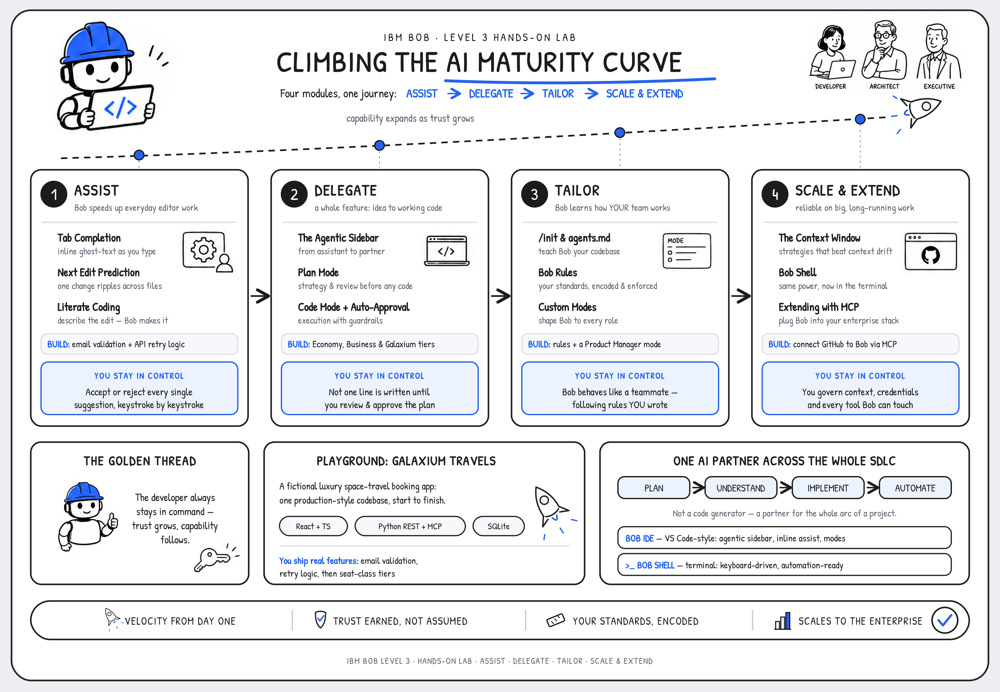

# **IBM Bob Level 3**

---

## **i. Climbing the AI Maturity Curve**

---

The four modules constituting the hands-on work ahead with **IBM Bob** trace the **AI Maturity Curve** — as you shift right along it, you will progressively hand Bob more responsibility, with Bob earning that trust by keeping you (the human) in command the entire way.

| Module | Stage | What it means for your developers — and your clients |
|--------|------|------------------------------------------------------|
| **1** | **Assist** | Bob accelerates everyday work in the editor, and you accept or reject every change. Velocity from day one with near-zero risk. |
| **2** | **Delegate** | Bob takes a whole feature from idea to working code, but builds only what you've reviewed and approved first. |
| **3** | **Tailor** | Bob learns your codebase, enforces your standards, and adapts to each role, so it behaves like a teammate who already knows how you work. |
| **4** | **Scale & Extend** | Bob stays reliable on large, long-running work and plugs into the tools your enterprise already runs. |

!!! note ""
    A core, unifying theme of the journey you're embarking upon: **the developer always stays in control.**
    
    At the *Assist* stage, control is regulated as you choose to accept (or reject) each generative AI-suggested code recommendation, keystroke by keystroke. Within the *Delegate* module, control is maintained through approval of Bob-generated plans before a single line of AI-generated code is written. At *Tailor*, it means encoding the very rules Bob must adhere to. Within the *Scale & Extend* module, it means governing context, credentials, and tool access.

As you and Bob together progress along the AI Maturity Curve, capabilities will expand as trust grows. This is *the* messaging to carry into a C-suite conversation: not "here are some features," but "here is how your teams grow into an AI partner without losing agency to an AI agent."

---

## **ii. What is IBM Bob?**

---

**IBM Bob is an AI-powered partner for the entire software development lifecycle (SDLC)**, and it lives where developers already work: inside the development environment itself. It is tempting to file Bob alongside the many code-completion assistants that have flooded the marketplace since LLMs arrived, but that comparison sells it short. Bob is not simply a code generator; it is a partner for every step in your weekly workflow (for developers, sellers, and executives alike.)

A code generator helps at the exact point in time that a function gets written. Bob is built to help across the whole arc of a project: planning a feature before a line of code exists, reasoning about an unfamiliar codebase, implementing changes, and automating the repetitive work that surrounds real development.

!!! note "**A WORD ON WORKING WITH GENERATIVE AI**"

    IBM Bob is powered by generative AI and LLMs, and a defining trait of these systems is that they are *non-deterministic* — unlike the *deterministic* tools most developers are accustomed to. In practice, that means the same prompt can produce different code from one run to the next. This is both a strength and a quirk of the technology, and it is something to work *with* rather than against.

    **Precision is what tips the odds in your favor.** The more clearly you describe what you want, the more closely Bob's output will mirror your intent; conversely, the smallest change in wording can meaningfully change the generated code. Throughout this lab, your results may differ from the solutions shown — and that is expected, not a defect. Whenever an output diverges, you have three good options: refine the prompt and try again, edit the generated code by hand, or simply proceed if the variation still compiles and runs. Human review remains essential at every step, and never more so than while you are still learning the tool.

 
At its core, Bob does three things exceptionally well:

- **Writes and modifies code** across an entire codebase, from natural language instructions
- **Understands codebases** by reading and reasoning about complex project structures, dependencies, and architectural patterns
- **Automates the busy-work of development:** from documentation, to commit messages, to test scaffolding

---

## **iii. Bob across the SDLC**

---

A core distinction between IBM Bob and other AI-assisted code generation tools, particular as it relates to the **software development lifecycle (SDLC)**, is *scope*. Where a traditional AI assistant is anchored to the moment of writing or fixing code, Bob is designed to support the full lifecycle around it. It helps plan features before implementation begins, understands the full context of a project before making changes, and keeps the developer in control at every step.

Bob augments the way your teams already work; it does not replace their judgment. Keep ahold of that last point as you work your way through the remainder of the hands-on material, as it is the thread that weaves together so many of Bob's strengths and its value to IBM clients.

---

## **iv. Bob IDE and Bob Shell**

---

Bob comes in two form factors to meet developers where they are most productive:

| Interface | Description |
|-----------|-------------|
| `Bob IDE`   | A VS Code extension providing an agentic sidebar, inline code assistance, and mode-based interaction |
| `Bob Shell` | A terminal-based interface offering the same capabilities in a keyboard-driven, automation-friendly form |

You will spend most of this course in the Bob IDE, where the Visual Studio Code-like user interface of the Bob IDE will already feel at-home to many developers and users. In the final module of the hands-on lab, you'll have the opportunity to briefly touch upon the Bob Shell interface — where you will find that everything learned up to that point also applies programatically as well.

---

## **v. Environment: Galaxium Travels**

---

> **Watch first:** [Chapter 1: Demo Application: Galaxium Travels \[IBM Bob L3\]](https://ibm.seismic.com/Link/Content/DCB6f2CRCCpcJ8TMpgH8Dd33T8D3)
>
> Maximilian Jesch *(Outbound Product Manager — IBM Bob)* walks through the demo scenario that ties the hands-on modules together. *\[2 min\]*

For the purposes of the hands-on materials and your untaking in building trust with IBM Bob, you'll be making use of the **Galaxium Travels** application and code base: a fictional, luxury space-travel booking system whose source code is publicly available on GitHub. Rather than show Bob as throwaway snippets and discrete feature demonstration, it's important to realize the full end-to-end journey that a customer will experience in working with the service. Therefore, this hands-on material will put you to work using a unified, production-style codebase from start to finish. It is the consistent backdrop against which each stage of the AI maturity curve comes to life.

Galaxium Travels follows a familiar full-stack shape:

- **Frontend:** React and TypeScript
- **Backend:** Python, exposing both REST and MCP interfaces
- **Database:** SQLite, with seed data for development and testing

!!! note ""
    The backend is organized around a SQLite database containing the domain's data models (flights, users, bookings), the schemas that validate them, and seed data to work with. It exposes the application two ways:

    1. A **REST API** of standard HTTP endpoints for the frontend and other clients
    2. A **Model Context Protocol (MCP) interface** that allows Bob to interact as a tool with the backend directly

    A local **API browser** is also available so that you can exercise endpoints (retrieving flights, registering users, making bookings) without needing to traverse the frontend application.

    The **React/TypeScript** frontend, for its part, connects to those same REST endpoints and mimics the experience that an end user (consumer of the luxury travel service) would see: browsing available flights, registering and signing in, and booking a seat.

As you move through the curriculum, you will continuously add new features to the application. The order of operations in adding these new capabilities is iterative and deliberate, with each building on the features of the previous function:

- **Email validation** — Module 1 | Next Edit Prediction
- **Retry logic for API calls** — Module 1 | Literate Coding
- **Seat-class tiers** (Economy, Business, Galaxium) — Module 2 | The Agentic Sidebar

---

## **vi. Next steps**

---

Working within one continuous codebase lets you watch Bob operate in the same way it would behave inside a client's real project. Should you wish to fully explore the source code yourself, it is publicly available and supported on GitHub.

The following Table of Contents summarizes the modules, sub-chapters, and topics to be covered across the scope of the Level 3 hands-on lab.

| MODULE | SECTION |
| - | - |
| <a href="https://ibm.github.io/bob-l3/assist/1-1/" target="_blank">**1. Assist**</a> | <a href="https://ibm.github.io/bob-l3/assist/1-1/" target="_blank">1. Tab Completion & Next Edit Prediction</a> <a href="https://ibm.github.io/bob-l3/assist/1-2/" target="_blank">2. Literate Coding</a>  |
| <a href="https://ibm.github.io/bob-l3/delegate/2-1/" target="_blank">**2. Delegate**</a> | <a href="https://ibm.github.io/bob-l3/delegate/2-1/" target="_blank">1. The Agentic Sidebar</a> <a href="https://ibm.github.io/bob-l3/delegate/2-2/" target="_blank">2. Applying Agentic Modes</a> |
| <a href="https://ibm.github.io/bob-l3/tailor/3-1/" target="_blank">**3. Tailor**</a> | <a href="https://ibm.github.io/bob-l3/tailor/3-1/" target="_blank">1. init & agents.md</a> <a href="https://ibm.github.io/bob-l3/tailor/3-2/" target="_blank">2. Bob Rules</a> <a href="https://ibm.github.io/bob-l3/tailor/3-3/" target="_blank">3. Custom Modes</a> |
| <a href="https://ibm.github.io/bob-l3/scale/4-1/" target="_blank">**4. Scale & Extend**</a> | <a href="https://ibm.github.io/bob-l3/scale/4-1/" target="_blank">1. The Context Window</a> <a href="https://ibm.github.io/bob-l3/scale/4-2/" target="_blank">2. Bob Shell</a> <a href="https://ibm.github.io/bob-l3/scale/4-3/" target="_blank">3. Custom Modes</a> <a href="https://ibm.github.io/bob-l3/scale/4-4/" target="_blank">4. Extending with MCP</a> |
