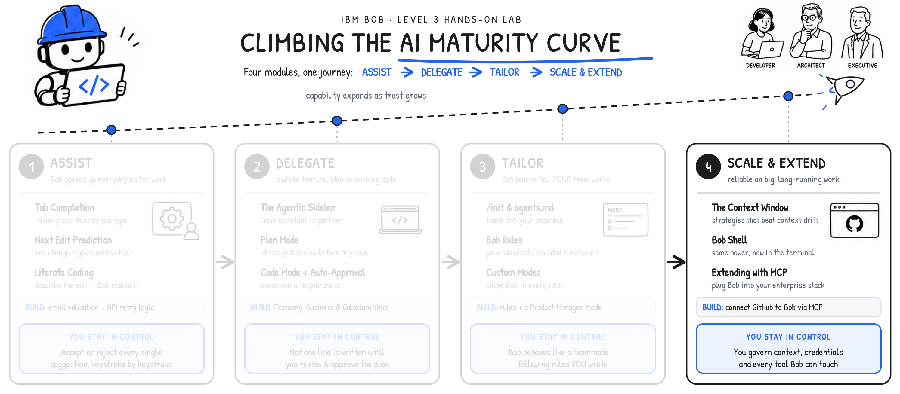

**MODULE 4 | SCALE & EXTEND**
# **THE CONTEXT WINDOW**

---

## **i. Keeping Bob reliable at scale**

---

Across this module, you will first look under the hood at the **context window** mechanics that make Bob tick. Arguably, the context window might be the single biggest factor in keeping Bob's output at the highest quality across the most ambitious tasks. The habits and best practices that developers (you) adopt in maximizing the utility of this resource can have tremendous impacts on the quality of work that Bob is able to perform.

Afterwards, you'll take Bob out of the IDE entirely and into the Terminal console: **Bob Shell**. This programmatic interface for Bob unlocks automation, scripting, and parallelized workstreams.

Finally, you will experiment with connecting Bob to your existing systems through **Model Context Protocol *(MCP)***, the open source standard that lets Bob interact directly with the external tools your teams use daily. *Governance* remains paramount at this stage. As the human-in-the-loop and final arbiter of control, you must decide what context Bob carries, what credentials it holds, and which tools it is permissioned to reach.

> **Watch first:** [Chapter 4.1: Context Window \[IBM Bob L3\]](https://ibm.seismic.com/Link/Content/DC4hp8R9Pm8mTGcFWTGGBRhjXqGG)
>
> Maximilian Jesch *(Outbound Product Manager — IBM Bob)* digs into the details of Bob's context window. *\[4 min\]*

!!! note ""
    By the end of <a href="https://ibm.github.io/bob-l3/tailor/3-3/" target="_blank">**Module 3 | Tailor**</a>, IBM Bob knew nearly every facet about your project, adhered to your organization's coding standards, and had adapted itself to each role on your team — and all of that was committed to the repository, shared, and automatically enforced. The final stage along the **AI Maturity Curve** journey reflects the two things that separate a *promising demo* from a *dependable enterprise partner*: staying *reliable* on the largest, longest-running workloads; ultimately, *connecting* to everything else that your organization already runs today.
    
    In other words, addressing the enterprise challenges of **Scale and Extensibility**.

## **ii. Why this matters**

---

The **context window** represents the total amount of information a large language model (LLM) can hold "in mind" during a single session or conversation. It is also sets the potential limit of how much work any given LLM can perform: the larger the context window, the more substantial scale of task that can be performed (and likely the higher quality output that can be achieved.) Understanding how a context window "fills" (and how to manage these finite resources effectively) is what separates a polished technology demonstration from one that degrades in quality halfway through the work.

This lesson is conceptual. There are no steps to run, but the habits it instills will shape every other interaction you have with Bob. In the following chapter, you will go hands-on once again and put this theory in practice.

---

## **iii. What is a context window?**

---

The models powering Bob offer a context window of **200,000 tokens** — roughly **150,000 words**, about the length of *The Fellowship of the Ring*. Every conversation begins with that full capacity available, and it holds *everything*: instructions, file contents, conversation history, and Bob's own responses. Once the window fills, the oldest content within the context window has to either be dropped from memory or summarized to make room.

At the start of every conversation, content loads in a predictable sequence:

| ORDER OF OPERATIONS | CONTENT | NOTES |
|-------|---------|-------|
| 1 | Bob system prompt | Hidden from the user; contains Bob's core instructions |
| 2 | Mode description | The definition of the currently active Bob Mode (*Code*, *Plan*, *Custom*, etc.) |
| 3 | Rules | Content from all files in `.bob/rules/` |
| 4 | MCP tool definitions | Can be very large, depending on the number and complexity of connected MCP servers |
| 5 | Conversation messages | User prompts and Bob's responses |
| 6 | File reads and writes | Contents of files Bob reads or produces during the conversation |

!!! note "THE IMPORTANCE OF GOVERNANCE"
    **MCP tool definitions** deserve special attention. The more external servers connected via MCP to Bob, the more rapidly that a significant slice of Bob's context window is exhausted before the user (you) send even a single message. This is why the importance of good *governance* and *planning* are emphasized again and again throughout this module.

## **iv. What happens when the context window is full?**

---

Reaching the 200,000-token limit doesn't stop Bob or throw an error. Instead, a new conversation starts automatically in the background.

Bob generates a summary of the previous conversation or session, and then that summary is pre-pended as context to the new conversation. Bob will carry on its responses and workflow seamlessly. The process is invisible to you — but it has real consequences for quality and cost, and that is precisely why it's worth understanding how to govern this resource allocation in detail.

The first cost: **summarization is lossy.** When a conversation overflows the context window size and needs to be summarized, the precision and fidelity of the original conversation are compromised. Specific technical details, intermediate reasoning, and nuanced context can be lost within the new Bob conversation. If a critical constraint or edge case was discussed early on, it may not persist into the summary or new conversation's memory, and as such implementation quality can suffer.

The second cost: **quality degrades above roughly 100,000 tokens.** Models don't hold uniform quality across the full range; as the window fills, responses noticeably decline, particularly past the ~100,000-token mark. A conversation using 50,000 tokens will generally produce better output than one using 180,000, all other things being equal. And because tokens are the unit of consumption (measured in *Bob Coins*), longer conversations and larger file reads also simply cost more of the finite context window. Less context used equates both *better output* and *lower costs*.

---

## **iv. Context window strategies: persistent artifacts**

---

The most effective way to manage all of this is with **persistent artifacts**. This strategy and pattern of work can be achieved in a variety of ways. Generally speaking, the most effective route involves breaking complex tasks into smaller, more discrete steps. This is, of course, a balancing act: one of the strengths of large language models (LLM) is being able to chain complex tasks into a single request or line of thought; however, the "art" in good prompting is balancing the complexity of those requests with the context window size available to the LLM.

One way to achieve this is having each step in an otherwise-complex workfow produce a saved output (such as a file on disk) and starting a new conversation for each major step with reference to those saved outputs. This keeps conversations and instructions *contained* in terms of size: no single conversation balloons too large in scale and every important decision is preserved as a durable file that you can point back to later.

---

You have already seen this in action. The seat-class feature from <a href="https://ibm.github.io/bob-l3/delegate/2-2/" target="_blank">**Module 2**</a> was built exactly this way:

| CONVERSATION | TASK | OUTPUT |
|--------------|------|--------|
| 1 | Plan the feature | `seat-class-implementation-plan.md`, `seat-class-architecture.md` |
| 2 | Implement based on plan | Code changes across frontend, backend, and database |

The implementation conversation consumed just **88,000 of 200,000 tokens**— comfortably within the high quality range —because the two-conversation split kept the planning discussion from competing with the implementation for space.

!!! note "CONTEXT WINDOW GUIDELINES"
    Several practical guidelines to keep in mind as you work with Bob's (and any other LLM's) context window:

    1. Start new conversations when you switch tasks (planning shouldn't bleed into implementation)
    2. Give preference to direct file references (`@/path/to/file`) over copy & paste from clipboard contents
    3. Keep MCP configurations lean, since every server's definitions will ultimately eat into the context window with every invocation
    4. Monitor token usage to see which interactions are most expensive and adjust accordingly.

## **v. Key takeaways**

---

- As of June 2026, Bob's context window is 200,000 tokens (~150,000 words) and every new conversation starts with a full allocation of this 200K capacity
- Context fills according to a hierarchy: **system prompts → mode description → rules → MCP tools → messages → file reads/writes**
- When the context window is exhausted, Bob auto-summarizes and seamlessly creates a new conversation under the covers (but summarization can be lossy)
- Quality noticeably degrades beyond ~100,000 tokens
- The *persistent artifacts* pattern (**plan → save → new conversation → implement**) is the primary strategy for managing context
- The less context window that is consumed, the higher quality of outputs and the lower costs for generation

 
In the following section, you will step away from theory (and the Bob IDE altogether) to go hands-on with the **Bob Shell** programmatic interface.

---