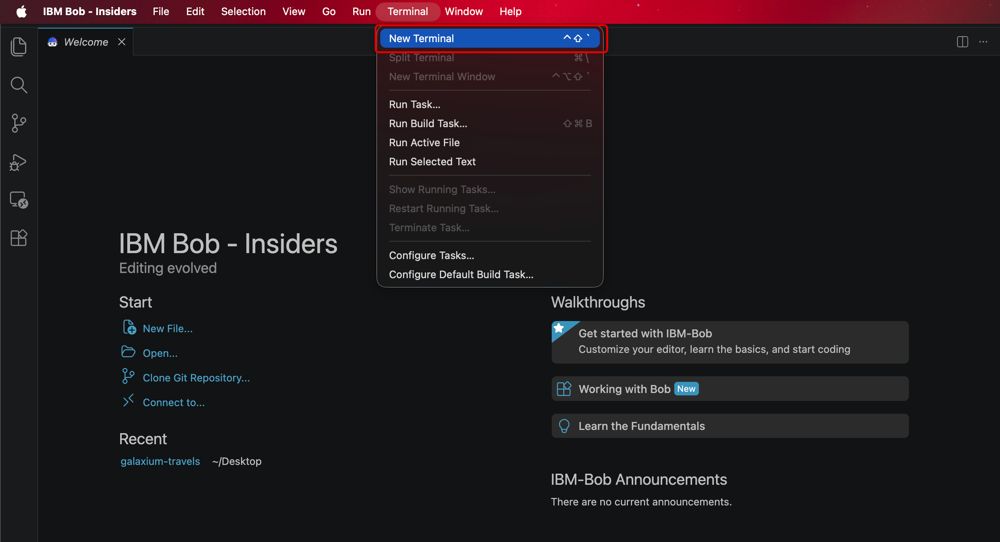

**GETTING STARTED**
# **REGISTRATION & SETUP**

---

## **i. Before you begin**

---

Before diving into the hands-on modules, complete the following registration and setup steps to prepare your machine with an authenticated **IBM Bob** account and a local copy of the *Galaxium Travels* demo application, which every module in this Level 3 courseware builds upon. Afterwards, you will be ready to begin **Module 1 | Assist**.

!!! note "**A WORD ON WORKING WITH GENERATIVE AI**"

    IBM Bob is powered by generative AI and LLMs, and a defining trait of these systems is that they are *non-deterministic* — unlike the *deterministic* tools most developers are accustomed to. In practice, that means the same prompt can produce different code from one run to the next. This is both a strength and a quirk of the technology, and it is something to work *with* rather than against.

    **Precision is what tips the odds in your favor.** The more clearly you describe what you want, the more closely Bob's output will mirror your intent; conversely, the smallest change in wording can meaningfully change the generated code. Throughout this lab, your results may differ from the solutions shown — and that is expected, not a defect. Whenever an output diverges, you have three good options: refine the prompt and try again, edit the generated code by hand, or simply proceed if the variation still compiles and runs. Human review remains essential at every step, and never more so than while you are still learning the tool.

## **ii. Choosing how to access Bob**

---

Before installing the demo application, you need an authenticated **IBM Bob account**. There are two registration paths to obtain one— as well as a shortcut if you already have access —and the few minutes you spend now, choosing the right one, can save you a great deal of time later.

| | TRIAL | INTERNAL |
|--|-------|----------|
| **Audience** | Anyone, including Business Partners (and IBMers using a personal email) | IBMers only |
| **Approval time** | Under 10 minutes | 24+ hours |
| **Access duration** | 1 month | Indefinite |
| **Bobcoin balance** | 40 Bobcoins | 100 Bobcoins (tied to your w3id) |
| **Registration email** | Must use a **non-IBM** email address | Your IBM w3id |

!!! note "WHICH PATH SHOULD I CHOOSE?"

    - **Trial**: the right choice if you are under time constraints, are a Business Partner, or have previously maxed out your Bobcoin balance. *(IBMers may use the Trial as well, though Internal is the official recommendation.)* Its 40 Bobcoins are more than enough to complete this lab, and access lasts a month — ample time, and easily renewed by creating another Trial account.
    - **Internal**: the right choice if you are an IBMer, aren't in a rush, and would like to keep exploring Bob beyond this lab. Note that the 100-Bobcoin balance is tied to your w3id, so if you have exhausted it elsewhere, that limit still applies here.
    - **Already have IBM Bob?** Skip both registration paths entirely and jump ahead to *Installing the Galaxium Travels demo app*. This assumes you have already installed and authenticated IBM Bob prior to this course.

!!! tip "IN A HURRY?"

    If your sole aim is to complete this Level 3 course as quickly as possible, take the **Trial** path and avoid waiting on manual approval altogether.

## **iii. Path A: Free Trial registration (Business Partners)**

---

The Trial path provides fast access, a fresh balance of 40 Bobcoins, and is open to the widest audience (**Business Partners included**). Access lapses after one month, which is more than enough time to complete this lab.

---

1. Begin at the **Free Trial** sign-up page:

    !!! note ""
        **<a href="https://bob.ibm.com/trial?utm_source=skills_network&utm_content=in_lab_content_link&utm_id=Lab-Demonstration+Guide+%5BBob+L3%5D-v1_1777325986" target="_blank">https://bob.ibm.com/trial?utm_source=skills_network&utm_content=in_lab_content_link&utm_id=Lab-Demonstration+Guide+%5BBob+L3%5D-v1_1777325986</a>**

    <p align="left">
    
    </p>

---

2. Check the inbox of the email you registered with, which should arrive nearly instantly.

    **Copy the 7-digit verification code** and return to the open IBM Bob Free Trial tab.

    <p align="left">
    
    </p>

---

3. Enter the **7-digit verification code** and press **Submit**.

    <p align="left">
    
    </p>

---

4. After submitting, you will be redirected to a confirmation page. Wait a few seconds until *"Your trial is ready!"* appears, then press **Access your trial now.**

    <p align="left">
    
    </p>

---

5. You will land on the *"Download Bob"* page. Download IBM Bob for your respective operating system.

    It follows the simple GUI-based install process you would expect of most desktop applications.

    <p align="left">
    
    </p>

---

6. Once IBM Bob has finished installing, **open IBM Bob** (if it has not opened already).

    Then press **Log in to Bob**.

    <p align="left">
    
    </p>

---

7. Press **Allow** on the pop-up window.

    <p align="left">
    
    </p>

---

8. Press **Open** on the subsequent pop-up window.

    <p align="left">
    
    </p>

---

9. On the IBM Verify sign-in page, expand the *"Choose an option"* drop-down and press **IBMid.**

    !!! warning "IBMers TAKING THE TRIAL PATH"

        If you are an IBMer attempting the Trial method while signed in to your actual IBM account (rather than the temporary one you created for Trial access), IBM Bob will try to sign in with that account — and if your primary IBMid has not been authenticated via Internal Registration, this will lead to problems.

        *To avoid this, sign out of any w3id accounts you do not intend to use, then open the sign-in link in a private browsing window. You may need to sign in again with your temporary IBM Trial email in that new window.*

    <p align="left">
    
    </p>

---

10. You should be redirected to an **"Authentication Successful!"** screen.

    Afterward, **return to the tab with IBM Bob open.**

    <p align="left">
    
    </p>

---

11. Press **Open** on the new window that has appeared on the IBM Bob screen.

    <p align="left">
    
    </p>

---

12. Look to the Agentic Sidebar — the window for entering prompts has opened. You have now successfully accessed your authenticated IBM Bob account.

    <p align="left">
    
    </p>

    !!! warning "NEXT STEP"

        With Bob authenticated, skip ahead to section <a href="https://ibm.github.io/bob-l3/setup/#v-installing-the-galaxium-travels-demo-app" target="_blank">**v. — *Installing the Galaxium Travels demo app***</a> and disregard the Internal path.

## **iv. Path B: Internal registration (IBMers)**

---

The Internal path is reserved for **IBMers who do not yet have IBM Bob**. It provides slower access but a larger, persistent balance of 100 Bobcoins across your w3id (resetting monthly), and it does not expire.

!!! note "BUSINESS PARTNER?"
    Business Partners should refer back to section <a href="https://ibm.github.io/bob-l3/setup/#iii-path-a-free-trial-registration" target="_blank">**iii. Path A: Free Trial registration**</a> for their registration path.

1. Begin at the [**Bob Enterprise Sales Assets**](https://techzone.ibm.com/collection/bob-enterprise-sales-assets?utm_source=skills_network&utm_content=in_lab_content_link&utm_id=Lab-Demonstration+Guide+%5BBob+L3%5D-v1_1777325986) page.

    Once there, click **Technical Resources** in the left sidebar.

    <p align="left">
    
    </p>

---

2. Click **See it** under the *"Internal Bob Sign Up"* tile.

    <p align="left">
    
    </p>

---

3. You will be redirected to a sign-up form. Enter all of the requested information and press **Submit.**

    <p align="left">
    
    </p>

---

4. Review your responses if you like, then confirm by clicking **Submit** once more in the pop-up window.

    There will be a *"Thank you"* pop-up that appears afterward — you can simply dismiss it.

    <p align="left">
    
    </p>

---

5. After submission, you will receive a confirmation email.

    <p align="left">
    
    </p>

---

6. At this point you will need to wait — as noted, approval typically takes at least 24 hours.

    Once approved, you will receive an email — follow the **Download Bob** hyperlink within it.

    <p align="left">
    
    </p>

---

7. The *Download Bob* link opens a Box folder containing download links for various operating systems. Locate the version appropriate for your OS and click it.

    <p align="left">
    
    </p>

---

8. Click the appropriate file within the folder.

    <p align="left">
    
    </p>

---

9. Click **Download**.

    <p align="left">
    
    </p>

---

10. Review the License Agreement, and if you accept its terms and conditions, toggle `I accept the agreement` and press **Next.**

    <p align="left">
    
    </p>

---

11. Continue through the GUI-based install process common to most desktop software — review the instructions on each Setup page to configure Bob to your liking, and press **Next** to proceed.

    <p align="left">
    
    </p>

---

12. Installation should take roughly 5–10 minutes.

    <p align="left">
    
    </p>

---

13. A completion pop-up appears.

    Tick **Launch IBM Bob** (if it is not already checked) and press **Finish**.
    <p align="left">
    
    </p>

---

14. IBM Bob opens. Click **Log in to Bob**.

    <p align="left">
    
    </p>

---

15. When prompted *The extension IBM Bob wants to sign in using Bob.*, click **Allow** to launch a web browser for authentication.

    Log in within the browser using your *IBMid* and *password* - those which are linked to the IBM Bob account you registered for in the previous steps.

    <p align="left">
    
    </p>

---

16. A few additional prompts may arise before authentication can complete:

    - If asked *"Do you want to allow this website to open IBM Bob?"*, click **Yes**
    - Wait until the web browser refreshes to read *Authentication Successful!* before closing the browser window
    - Return to the Bob IDE, which has now been successfully authenticated and connected to the IBM Bob service

    <p align="left">
    
    </p>


## **v. Installing the Galaxium Travels demo app**

---

With IBM Bob authenticated, the final piece of setup is a local copy of the *Galaxium Travels* codebase — the single, production-style application that every module in this lab builds upon.

!!! note "PREREQUISITES"

    If you do not already have them installed, you will need the following. **npm** is bundled with Node.js.

    - **Python 3.8+** — <a href="https://www.python.org/downloads/" target="_blank">Download</a>
    - **Node.js 18+** — <a href="https://nodejs.org/" target="_blank">Download</a>

1. Open a **Terminal** window, then copy and paste the following command and execute it to clone the project (along with the `bob-learning-path-branch` that contains the tutorial code):

    ``` bash
    git clone -b bob-learning-path-branch https://github.com/IBM/galaxium-travels
    ```
    

---

2. Next, move into the `galaxium-travels` directory by copying & pasting into the Terminal console the command that **matches your operating system**, then press ++enter++ to execute:

    ??? quote "MAC OR LINUX"
        ``` bash
        cd ~/galaxium-travels
        ```
    ??? quote "WINDOWS OS"
        ``` bash
        cd $HOME\galaxium-travels
        ```

    <p align="left">
    
    </p>

---

## **vi. Starting the Galaxium Travels application**

---

The commands to be issued to the Terminal console, in order to start the Galaxium Travels application, vary according to the operating system your machine is running upon.

From the expandable options below, follow and execute the instructions aligned to **your machine's OS** (either Mac/Linux or Windows). After completing the instructions within the appropriate tab, proceed to the next step in the lab guide.

??? quote "MAC OR LINUX"
    Starting the application on macOS and Linux is straightforward: a single script brings up both the backend and the frontend.

    1. Within the Terminal, copy and paste the following start-up script and press ++enter++ to execute:

        ``` bash
        ./start.sh
        ```

        ??? warning "ONE-LINE STARTUP NOT WORKING? (MANUAL PROCESS)"

            Execute each command separately, opening a new Terminal window where directed (for the frontend start-up).

            **Start the backend:**
            ```
            cd booking_system_backend
            python -m venv .venv
            source .venv/bin/activate  # On Windows: .venv\Scripts\activate
            pip install -r requirements.txt
            python server.py

            ```

            **Start the frontend (in a new Terminal window):**
            ```
            cd booking_system_frontend
            npm install
            npm run dev

            ```

        

    ---

    2. The app has started successfully. To reach the frontend, copy the local URL it reports — it should resemble the following address:

        !!! warning "WEB BROWSER"
            http://localhost:5173/

        <p align="left">
        
        </p>

    ---

    3. Switch back to your web browser.

        <p align="left">
        
        </p>

    ---

    4. Paste the address you just copied into the search bar and press ++enter++ to open the page:

        !!! warning "WEB BROWSER"
            http://localhost:5173/

        <p align="left">
        
        </p>

    ---

    5. You have now successfully reached the frontend of the *Galaxium Travels* demo application.

        !!! warning "KEEP THIS WINDOW OR TAB OPEN"
            You will return to the *Galaxium Travels* application within the web browser frequently during these lab exercises.
        <p align="left">
        
        </p>

    ---

    6. Return to IBM Bob and click **Explorer** (*or press* ++ctrl+shift+e++).

        <p align="left">
        
        </p>

    ---

    7. Click **Open Folder.**

        <p align="left">
        
        </p>

    ---

    8. Navigate to the location of the `galaxium-travels` folder, then **select galaxium-travels**.

        !!! quote ""
            This is whatever directory you were in when you ran the `git clone` command — most likely your `home` / `user-profile` directory.
        <p align="left">
        
        </p>

    ---

    9. With the `galaxium-travels` folder open, expand the drop-down arrow to reveal additional options.

        <p align="left">
        
        </p>

    ---

    10. You can now see the sub-folders that make up the web app.
    
        This is where you will modify the code to demonstrate IBM Bob's capabilities throughout the lab.

        <p align="left">
        
        </p>

    ---
    
    !!! note "SETUP COMPLETE"

        With the app running and the project open in Bob, your local environment is ready — continue to *section vii*.

??? quote "WINDOWS OS"

    On Windows, bringing the app up takes a little more manual effort.

    1. In a **Terminal** window, paste and execute each of the following commands **one at a time**, pressing ++enter++ after each:

        **Step 1:**
        ```
        cd $HOME\galaxium-travels
        ```
        **Step 2:**
        ```
        cd booking_system_backend

        ```
        **Step 3:**
        ```
        python -m venv .venv

        ```
        **Step 4:**
        ```
        .venv\Scripts\activate

        ```
        **Step 5:**
        ```
        pip install -r requirements.txt

        ```

        After the `pip install` command, the requirements will begin installing — this takes roughly 5–10 minutes to complete.

        <p align="left">
        
        </p>

    ---

    2. In the **same** Terminal window, paste and execute:

        ```
        python server.py
        ```

        Afterward, **open a new Terminal window by pressing the Plus (+) button.**

        <p align="left">
        
        </p>

    ---

    3. In the new Terminal window, run the following commands in sequence:

        **Step 1:**
        ```
        cd $HOME\galaxium-travels

        ```
        **Step 2:**
        ```
        cd booking_system_frontend

        ```
        **Step 3:**
        ```
        npm install

        ```
        **Step 4:**
        ```
        npm run dev

        ```

        <p align="left">
        
        </p>

    ---

    4. After running the commands (whether `./start.sh` on macOS/Linux or the manual Windows steps above), you will see *Vite — ready in \_\_\_ ms*.

        You will also see a localhost URL — most likely `http://localhost:5173/`. **Copy this link.**

        <p align="left">
        
        </p>

    ---

    5. Open your web browser and paste the URL you saw — as noted, this is most likely `http://localhost:5173/` (unless another instance of Vite is already running).

        <p align="left">
        
        </p>

    ---

    6. You are now successfully connected to the *Galaxium Travels* demo app.

        !!! warning "KEEP THIS WINDOW OR TAB OPEN"
            You will return to the *Galaxium Travels* application within the web browser frequently during these lab exercises.
        <p align="left">
        
        </p>

    ---

    7. Return to IBM Bob and click **Explorer** (*or press* ++ctrl+shift+e++).

        <p align="left">
        
        </p>

    ---

    8. Click **Open Folder.**

        <p align="left">
        
        </p>

    ---

    9. Navigate to the location of the `galaxium-travels` folder, then **select galaxium-travels**.

        *This is whatever directory you were in when you ran the `git clone` command — most likely your home / user-profile directory.*

        <p align="left">
        
        </p>

    ---

    10. With the `galaxium-travels` folder open, expand the drop-down arrow.

        <p align="left">
        
        </p>

    ---

    11. You can now see the sub-folders that make up the web app — this is where you will modify the code to demonstrate IBM Bob's capabilities throughout the lab.

        <p align="left">
        
        </p>

        !!! note "SETUP COMPLETE"

            With the app running and the project open in Bob, your local environment is ready — continue to *section viii*.

---

## **viii. You're ready to proceed**

---

Setup is complete: IBM Bob is authenticated, the *Galaxium Travels* application is running locally, and the project is open within the Bob IDE. You are ready to begin the hands-on work and watch Bob operate inside a production-style codebase, exactly as it would within a client's real project.

Onward to **<a href="https://ibm.github.io/bob-l3/assist/1-1/" target="_blank">Module 1 | Assist</a>**, where you'll begin at the gentlest stage of the **AI Maturity Curve**: Bob working shoulder to shoulder with you inside the editor.

---