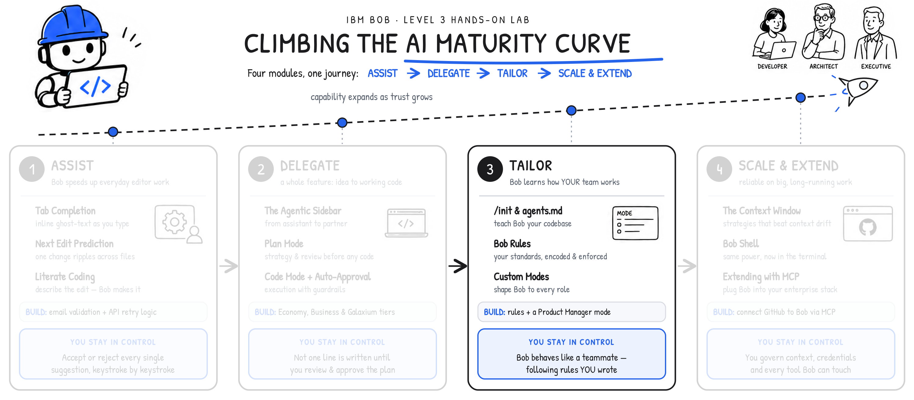

**MODULE 3 | TAILOR**
# **BOB RULES**

---

## **i. Encoding Bob with your standards**

---

> **Watch first:** [Chapter 3.2: Bob Rules \[IBM Bob L3\]](https://ibm.seismic.com/Link/Content/DCGHgh4QqJPWVGf2cgGpgM3hp6Md)
>
> Maximilian Jesch *(Outbound Product Manager — IBM Bob)* shows how defined rule sets enforce consistency and cut down on repeated instructions. *\[3 min\]*

If `agents.md` can teach Bob *what your project is*, **Rules** teach Bob *how you expect it to behave*.

Rules are plain-text files containing instructions that apply to every conversation between users and Bob. Rules, therefore, provide a way for teams and individuals to enforce coding standards, communication preferences, workflow constraints, and custom behaviors — without requiring them to be reintroduced with every new chat prompt. Every file in the Rules folder is automatically injected into each conversation, across all Bob Modes (Code, Plan, Ask, Advanced, and any custom modes you create.)

---

## **ii. Why this matters**

---

A **documentation standard** keeps generated code consistently commented:

```
Always include concise `JSDoc` strings for every public function.
```

A **communication-style rule** shapes how Bob phrases responses and comments (useful for teams that prefer terse output):

```
Be very concise in your wording.
```

And one particularly powerful pattern is the **internal monologue** rule which instructs Bob to log a summary of every interaction:

```
Write a summary of every interaction into the folder `internal-monologue/`.
Name the file starting with a timestamp, followed by a concise description of the interaction.
Example: `2026-01-15_update-readme.md`
```
!!! note ""
    This singular rule produces a persistent record of everything Bob has done:

    - An **audit trail** of what changed across a project's codebase and when
    - **Cross-section continuity** that Bob can refer back to in future conversations
    - **Team transparency** in shared repositories, where the monologue details what each teammate has done with Bob

## **iii. Project vs. global scope rules**

---

**Project-level rules** apply only to the *current* project that Bob is engaged with and are stored within the following directory structure:

```
.bob/rules/
```

Drop any plain-text or Markdown file into this endpoint and Bob will guarantee that each artifact is ingested prior to the start of every conversation.

**Global rules** apply across *all projects* on the local machine that the Bob IDE is acting upon. Such rules live in a separate, user-level directory, the exact path of which depends on your local machine's operating system.

---

Rules from both locations can be combined and applied together:

| SCOPE | LOCATION | USE CASE |
|-------|----------|----------|
| Project | `.bob/rules/` in project root | Rules specific to one codebase (framework conventions, project documentation standards) |
| Global | User-level rules directory | Rules that apply everywhere (internal monologue, personal communication preferences) |



!!! note "RULES ARE COMMITTED TO THE REPOSITORY"
    This is the heart of the ***Tailor*** stage in your progression towards the right-side of the **AI Maturity Curve**.
    
    Project-level rules in **`.bob/rules/`** are version-controlled, much in the same way as the actual project code. This means that Bob Rules that you define will automatically:
    
    - Propagate to every teammate who clones the shared repository
    - Performs changes to repositories as they go through normal code review processes
    - Tracked in *git* for trace-back on the complete version history.
    
    The control that you manually exercised in ***Assist***— which you then later entrusted with more autonomy to Bob in the ***Delegate*** phase —now becomes a durable, shared, and reviewable artifact in the ***Tailor*** phase of the journey.

## **iv. Hands-on: setting standards with Bob Rules**

---

> **Follow the video** for a full walkthrough: [Chapter 3.2: Bob Rules \[IBM Bob L3\]](https://ibm.seismic.com/Link/Content/DCGHgh4QqJPWVGf2cgGpgM3hp6Md)

In the steps ahead, you will create a rules file for *Galaxium Travels* and configure a set three standing rules. Afterwards, you will test and validate the efficacy of these rules by initiating a fresh conversation with Bob.

---

1. Within the Bob IDE, click the **File Explorer** tab.

    - Locate the **`.bob`** directory, which should be positioned directly under the `GALAXIUM-TRAVELS` folder header
    - Right-click **`.bob`** to expose additional options

    <p align="left">
    
    </p>

---

2. From the drop-down menu, select **New Folder...** to proceed.

    <p align="left">
    
    </p>

---

3. A text box will appear waiting for input.

    Name the folder **`rules`** and press ++return++ to continue.
    <p align="left">
    
    </p>

---

4. Right-click the newly-created **`rules`** folder.

    <p align="left">
    
    </p>

---

5. Click **New File...** from the drop-down options.

    <p align="left">
    
    </p>

---

6. A text box will appear waiting for input.

    Name the file **`basic_rules.md`** and press ++return++ to continue.
    <p align="left">
    
    </p>

---

7. Double left-click on **`basic_rules.md`** to expose its contents (which for now are empty).

    !!! warning ""
        Bob supports several *"priority levels"* of rules. You may configure them by hand by copy and pasting directly into the Markdown file; alternatively, and more simply, you can also configure them through Bob's **Agentic Sidebar**.
    <p align="left">
    
    </p>

---

8. First, verify that Bob's Agentic Sidebar is still set to **Code mode**. When ready, ++ctrl++ + ++c++ and ++ctrl++ + ++v++ the entire contents of the prompt below into the Agentic Sidebar, then press **Send**:

    ``` hl_lines="1"
    Please add the following rules to @/.bob/rules/basic_rules.md and configure them so they work:
    - Always include concise JSDoc strings for every public function.
    - Be very concise in your wording.
    - Write a summary of every interaction into the folder `internal-monologue/`.Name the file starting with a timestamp, followed by a concise description of the interaction. Example: 2026-01-15_update-readme.md
    ```

    <p align="left">
    
    </p>

---

9. If prompted by Bob along the way, click the blue **Approve** button to keep things moving.

    <p align="left">
    
    </p>

---

10. As before, Bob will generate a *Todo List* as it sets to work.

    Continue selecting **Approve All** when prompted to allow Bob to carry on with the work until complete.

    <p align="left">
    
    </p>

---

11. Bob will ask for permission to edit the protected configuration file you made earlier **Step 6** (the empty `basic_rules.md` file).

    **Grant** Bob permission to do so, if prompted.

    <p align="left">
    
    </p>

---

12. Continue progressing (approving Bob's requests) through the workflow. As you do so, you'll watch `basic_rules.md` fill with the rules you requested and reformat itself automatically.

    <p align="left">
    
    </p>

---

13. On completion of the workflow, Bob will return a **`Task Completed`** message to the console.

    - With this message received, it's now time for you to test the rules with a new Bob conversation, free of any previous context
    - Press the **X** in the top corner to close the current Bob session
    <p align="left">
    
    </p>

---

14. Create a new Chat session and enter the following prompt:

    ```
    Update the readme
    ```

    Afterwards, press the **Send** button.

    <p align="left">
    
    </p>

---

15. As before, Bob will generate a *Todo List* as it sets to work.

    !!! warning ""
        Take note that the *Todo List* now includes the creation of an internal-monologue summary — a telltale sign that your new ruleset is being adhered to.

    <p align="left">
    
    </p>

---

16. Continue selecting **Approve All** when prompted to allow Bob to carry on with the work until complete.

    <p align="left">
    
    </p>

---

17. Continue through the Agentic Sidebar workflow as you would during a typical interaction.

    !!! warning ""
        From time to time, a prompt may appear requesting a text response (rather than one of the blue action buttons.) For example, Bob may ask for additional details about how the `README` file should be updated.
        
        If you receive a prompt such as this, the specific response you provide is **not** consequential for this lab, so feel free to enter any option or details you prefer.
    <p align="left">
    
    </p>

---

18. Eventually, a *diff view* will appear containing the proposed changes to the `README` file.

    - Red text indicates content that is now scheduled to be removed
    - Color-highlighed text indicates new content that is scheduled to be added
    <p align="left">
    
    </p>

---

19. An internal-monologue (**`# Interaction Summary`**) entry is also created within the `basic_rules.md` file, exactly to the specifications requested in the new ruleset.

    <p align="left">
    
    </p>

---

20. On completion of the workflow, Bob will return a **`Task Completed`** message to the console.

    - As requested by the "update the `README`" prompt, the `README` file has been modified as an internal-monologue document
    - Note that this new `.md` file adheres to the `yyyy-mm-dd_NAME.md` naming format that was specified in the new ruleset
    <p align="left">
    
    </p>
    !!! warning "DEBUGGING RULESETS"

        Recall that IBM Bob supports two rule scopes— **Global** and **Workspace** —and within each, mode-specific rules can also be applied. Bob may occasionally overlook Workspace-level rules. Global rules and agent-specific project rules tend to be followed more strictly.

        If your rules aren't being honored as expected, send a prompt to the *Agentic Sidebar* such as the following:
        ```
        My project level rules in @/.bob/rules/basic_rules.md are not being listened to, please configure them properly
        ```
        Submit the prompt and then proceed through the workflow. Bob may add the rules to each `agents.md` file, apply them for a single instance, or take another approach.

## **v. Key takeaways**

---

- Rules are plain-text files in `.bob/rules/` that Bob reads and internalizes at the start of every conversation
- These rules apply across all Bob Modes (but can be made Mode-specific if placed in particular rule directories)
- Rules enforce consistent behavior without needing to re-introduce or repeat instructions with every session
- Internal-monologue pattern rules give you an audit trail of Bob's actions across all sessions
- Project-level rules are committed to the repository, making them available to the whole team
- Global rules apply across every project on the machine

</br>
IBM Bob is endlessly malleable. You can tailor it behave the way you want, according to the pattern of work that fits your team. In the chapter ahead, you will explore the ways that **Custom Modes** can further shape Bob's behavior to every role within your organization.