**MODULE 3 | TAILOR**
# **BOB RULES**

---

## **i. Encoding Bob with your standards**

---

If `AGENTS.md` can teach Bob *what your project is*, **Rules** teach Bob *how you expect it to behave*.

Rules are plain-text files containing instructions that apply to every conversation between users and Bob. Rules, therefore, provide a way for teams and individuals to enforce coding standards, communication preferences, workflow constraints, and custom behaviors — without requiring them to be reintroduced with every new chat prompt. Every file in the Rules folder is automatically injected into each conversation, across all Bob Modes (Agent, Plan, Ask, and any custom modes you create.)

---

## **ii. Why this matters**

---

A **documentation standard** keeps generated code consistently commented:

```
Always include concise `JSDoc` strings for every public function.
```

A **communication-style rule** shapes how Bob phrases responses and comments (useful for teams that prefer terse output):

```
Be very concise in your wording.
```

And one particularly powerful pattern is the **internal monologue** rule which instructs Bob to log a summary of every interaction:

```
Write a summary of every interaction into the folder `internal-monologue/`.
Name the file starting with a timestamp, followed by a concise description of the interaction.
Example: `2026-01-15_update-readme.md`
```
!!! note ""
    This singular rule produces a persistent record of everything Bob has done:

    - An **audit trail** of what changed across a project's codebase and when
    - **Cross-section continuity** that Bob can refer back to in future conversations
    - **Team transparency** in shared repositories, where the monologue details what each teammate has done with Bob

## **iii. Project vs. global scope rules**

---

**Project-level rules** apply only to the *current* project that Bob is engaged with and are stored within the following directory structure:

```
.bob/rules/
```

Drop any plain-text or Markdown file into this endpoint and Bob will guarantee that each artifact is ingested prior to the start of every conversation.

**Global rules** apply across *all projects* on the local machine that the Bob IDE is acting upon. Such rules live in a separate, user-level directory, the exact path of which depends on your local machine's operating system.

---

Rules from both locations can be combined and applied together:

| SCOPE | LOCATION | USE CASE |
|-------|----------|----------|
| Project | `.bob/rules/` in project root | Rules specific to one codebase (framework conventions, project documentation standards) |
| Global | User-level rules directory | Rules that apply everywhere (internal monologue, personal communication preferences) |


!!! note "RULES ARE COMMITTED TO THE REPOSITORY"
    This is the heart of the ***Tailor*** stage in your progression towards the right-side of the **AI Maturity Curve**.
    
    Project-level rules in **`.bob/rules/`** are version-controlled, much in the same way as the actual project code. This means that Bob Rules that you define will automatically:
    
    - Propagate to every teammate who clones the shared repository
    - Performs changes to repositories as they go through normal code review processes
    - Tracked in *git* for trace-back on the complete version history.
    
    The control that you manually exercised in ***Assist***— which you then later entrusted with more autonomy to Bob in the ***Delegate*** phase —now becomes a durable, shared, and reviewable artifact in the ***Tailor*** phase of the journey.

## **iv. Hands-on: setting standards with Bob Rules**

---

1. Within the Bob IDE, click the **Explorer** tab.

    Locate the **`.bob`** directory, which should be positioned directly under the `GALAXIUM-TRAVELS` folder header.

    !!! warning "CAN'T FIND BOB?"
        If no **`.bob`** directory appears within the project hierarchy, you need to run the `/init` command within the Agentic Sidebar and approve the generation steps. Follow the documentation from the **<a href=https://ibm.github.io/bob-l3/tailor/3-1/" target="_blank">previous chapter</a>** for more details.
    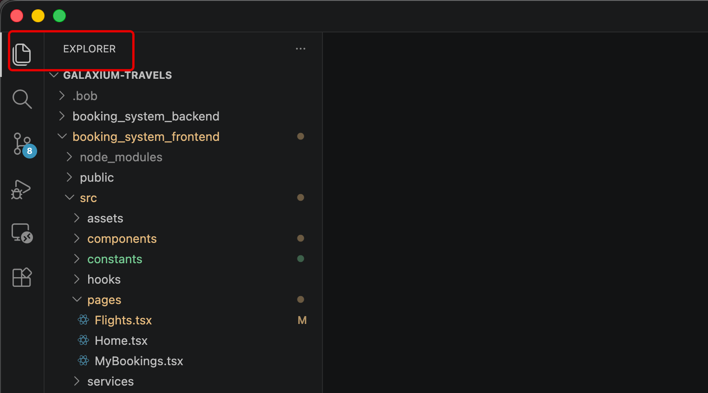
    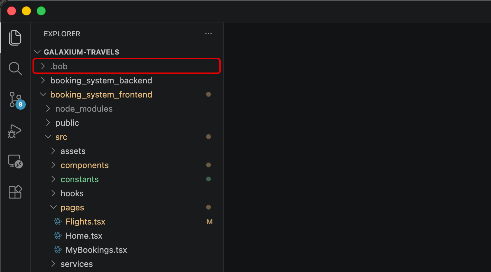

---

2. Right-click **`.bob`** to expose additional options.

    - From the drop-down menu, select **New Folder...**
    - Name the folder **`rules`** and press ++return++ to confirm

    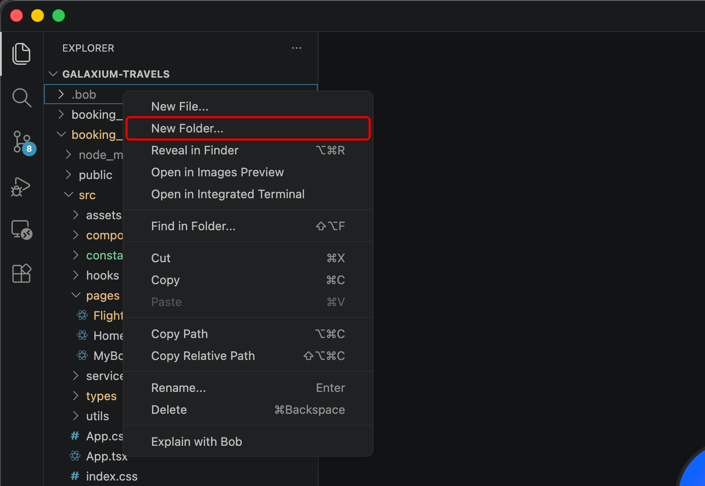
    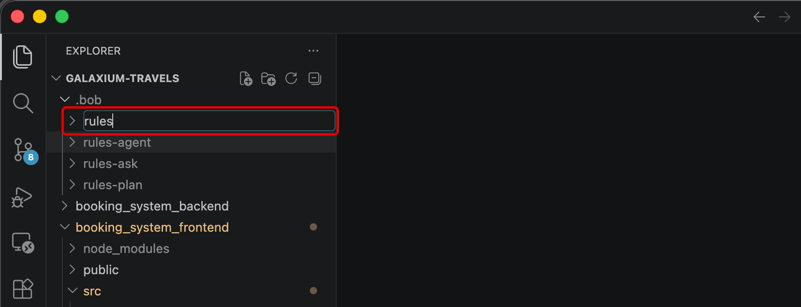

---

3. Right-click the newly-created **`rules`** folder.

    Click **New File...** from the drop-down options.
    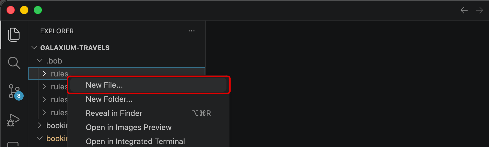

---

4. Name the file **`basic_rules.md`** and press ++return++ to confirm.

    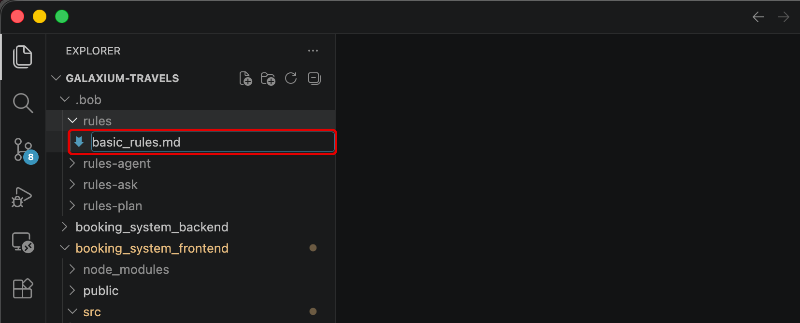

---

5. The file should automatically open within the Bob IDE, exposing its contents (which are empty for the time being.)

    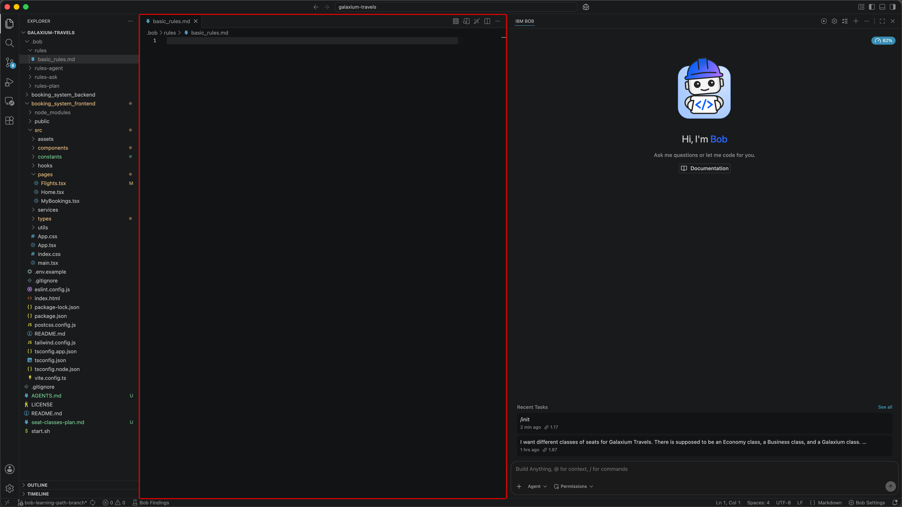

---

6. First, verify that Bob's Agentic Sidebar is still set to **Agent mode**.

    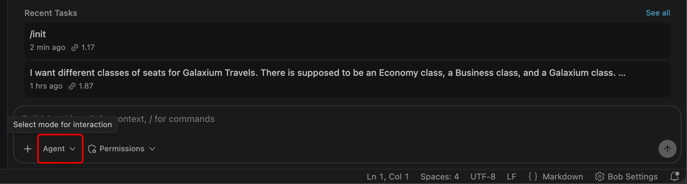

---

7. Next, create a new session of the **Agentic Sidebar** to clear all previous context. Use the **New Task** (++plus++) button in the top-right corner of the Agentic Sidebar to do so.

    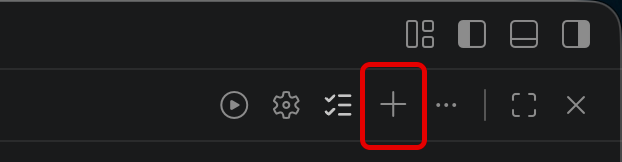

---

8. When ready, copy & paste the entire contents of the prompt below **into the Agentic Sidebar** and press ++return++ to execute:

    ``` hl_lines="1"
    Please add the following rules to @/.bob/rules/basic_rules.md and configure them so they work:
    - Always include concise JSDoc strings for every public function.
    - Be very concise in your wording.
    - Write a summary of every interaction into the folder `internal-monologue/`.Name the file starting with a timestamp, followed by a concise description of the interaction. Example: 2026-01-15_update-readme.md
    ```
    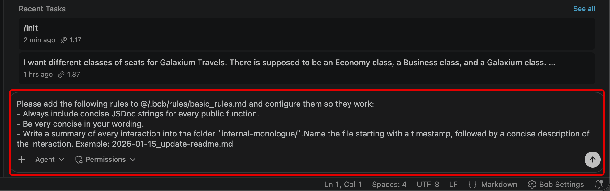

---

9. Bob will prompt you for permission to execute on several different tasks, including the ability to write a file within `.bob/rules/basic_rules.md` Markdown document.

    **Approve** these requests. We will examine the contents shortly once all work on the original request has completed and these files have been fully updated.
    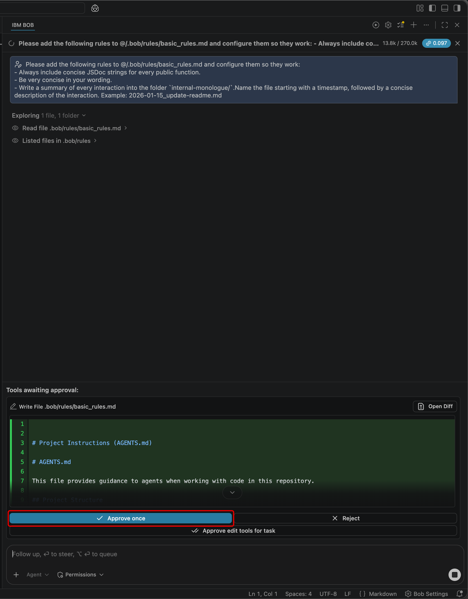

---

10. Bob will ask to construct three new rules for an `internal-monologue/` folder, consisting of the following:
    
    - **JSDoc / docstrings** | new `## Coding Standards` section requiring a concise JSDoc on every public TS function and a one-line docstring on every public Python function.
    - **Concise wording** | rule to keep all comments, docstrings, and prose brief.
    - **Interaction logging** | new `## Interaction Logging` section instructing the agent to write a timestamped summary to internal-monologue/ after every interaction.

    Take note that these rules are in alignment with the earlier instruction given via the Agentic Sidebar request.
    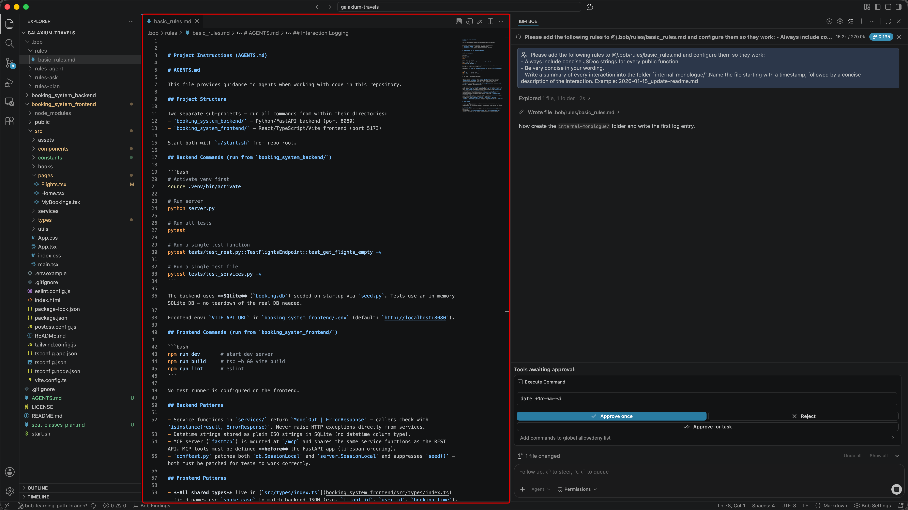
    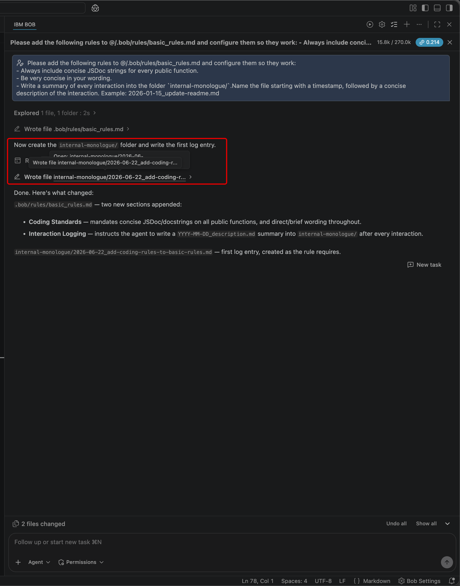

---

11. The workflow is complete once the Agentic Sidebar reports back the following (or something similar): ***The `internal-monologue/` folder was created with `2026-06-20_add-coding-rules.md` as the first log entry.***

    At this point, you should inspect the contents of the `.bob/rules/basic_rules.md` to validate the generative steps taken by Bob. You may do so by: clicking the file shortcut directly within the Agentic Sidebar session; via the **Explorer** tab project directory tree; or review within the documentation below.

    !!! quote "`.bob/rules/basic_rules.md`"
        ``` md linenums="1" hl_lines="14 46 63 80 88"
            # Project Instructions (AGENTS.md)

            # AGENTS.md

            This file provides guidance to agents when working with code in this repository.

            ## Project Overview
            Galaxium Travels — an interplanetary flight booking system. The backend also exposes an **MCP server** (mounted at `/mcp`) alongside the REST API, both served from the same FastAPI process on port 8080.

            ## Stack
            - **Backend**: Python/FastAPI + SQLAlchemy (SQLite) + FastMCP. Entry point: `booking_system_backend/server.py`, run via `python server.py`.
            - **Frontend**: React 19 + TypeScript + Vite + Tailwind CSS. Run via `npm run dev` (from `booking_system_frontend/`).

            ## Commands

            ### Backend (run from `booking_system_backend/`, with `.venv` active)
            ```bash
            # Setup
            python3 -m venv .venv && source .venv/bin/activate && pip install -r requirements.txt

            # Run server
            python server.py   # http://localhost:8080, Swagger at /docs, MCP at /mcp

            # Run all tests
            pytest

            # Run a single test function
            pytest tests/test_services.py::TestBookingService::test_book_flight_success -v

            # Run a single test file
            pytest tests/test_rest.py -v
            ```

            ### Frontend (run from `booking_system_frontend/`)
            ```bash
            npm run dev      # http://localhost:5173
            npm run build    # tsc -b && vite build
            npm run lint     # eslint .
            ```

            ### Start both together (from repo root)
            ```bash
            ./start.sh
            ```

            ## Critical Backend Patterns

            ### Error handling: return ErrorResponse, don't raise
            Service functions return `BookingOut | ErrorResponse` (or similar). **Never raise exceptions** from service layer — return an `ErrorResponse` instance instead. REST endpoints return these directly; MCP tools convert them to `raise Exception(result.details or result.error)`.

            ### Seat classes: exactly three, specific names
            Valid seat classes are `"economy"`, `"business"`, `"galaxium"`. The Flight model has three separate seat columns (`economy_seats`, `business_seats`, `galaxium_seats`). There is no generic `seats_available` column — the `SEAT_CLASS_MAP` in `services/booking.py` maps class names to column names.

            ### Timestamps are ISO strings, stored as String columns
            Both `departure_time`/`arrival_time` on Flight and `booking_time` on Booking are `String` columns (not DateTime). `booking_time` is written as `datetime.utcnow().isoformat()`.

            ### Pydantic schemas use `model_validate()`, not `from_orm()`
            All schemas that wrap ORM models use `class Config: from_attributes = True`. Construct them with `BookingOut.model_validate(obj)`, not `.from_orm()`.

            ### Tests use in-memory SQLite + monkeypatching
            `conftest.py` patches both `db.SessionLocal` and `server.SessionLocal` (the MCP tools use `SessionLocal` directly, bypassing FastAPI dependency injection). Each test gets a fresh DB; `seed()` is patched to a no-op.

            ## Critical Frontend Patterns

            ### API base URL from env
            Configure `VITE_API_URL` in `.env` (see `.env.example`). Defaults to `http://localhost:8080`.

            ### Error detection: check `response.success === false`
            Use the `isErrorResponse(response)` helper from `src/services/api.ts` to distinguish `ErrorResponse` from success types. It checks `response.success === false`.

            ### Seat class utilities: use `src/utils/seatClasses.ts`
            Use `getSeatClassPrice(basePrice, seatClass)` for price with multipliers (economy ×1, business ×1.5, galaxium ×2.5) and `getSeatCount(flight, seatClass)` to read per-class seat counts. **Price is stored as an integer (cents/whole units)**; `formatCurrency` in `src/utils/formatters.ts` formats it as USD.

            ### TypeScript strictness
            `tsconfig.app.json` enables `strict`, `noUnusedLocals`, `noUnusedParameters`, and `verbatimModuleSyntax`. All types live in `src/types/index.ts`.

            ### Tailwind custom tokens
            Use project-specific color tokens: `space-dark`, `space-blue`, `cosmic-purple`, `nebula-pink`, `alien-green`, `solar-orange`, `star-white`. Backgrounds: `bg-space-gradient`, `bg-cosmic-gradient`.

            ## Coding Standards

            ### JSDoc for every public function
            Always include a concise JSDoc comment on every public function (frontend TypeScript) and a one-line docstring on every public function (backend Python). Keep wording brief — one sentence is enough.

            ### Concise wording
            Be very concise in all code comments, docstrings, and prose. Prefer short, direct sentences.

            ## Interaction Logging

            After every interaction, write a summary Markdown file to the `internal-monologue/` folder in the repo root.
            - Filename format: `YYYY-MM-DD_concise-description.md` (e.g. `2026-01-15_update-readme.md`).
            - Content: a brief summary of what was requested and what was done.
            - Create the `internal-monologue/` folder if it does not exist.
        ```

---

**DEBUGGING RULESETS**

Recall that IBM Bob supports two rule scopes— **Global** and **Workspace** —and within each, mode-specific rules can also be applied. Bob may occasionally overlook Workspace-level rules. Global rules and agent-specific project rules tend to be followed more strictly.

If your rules aren't being honored as expected, send a prompt to the *Agentic Sidebar* such as the following:
    ```
    My project level rules in @/.bob/rules/basic_rules.md are not being listened to, please configure them properly
    ```

Submit the prompt and then proceed through the workflow. Bob may add the rules to each `AGENTS.md` file, apply them for a single instance, or take another approach.

---

## **v. Key takeaways**

---

- Rules are plain-text files in `.bob/rules/` that Bob reads and internalizes at the start of every conversation
- These rules apply across all Bob Modes (but can be made Mode-specific if placed in particular rule directories)
- Rules enforce consistent behavior without needing to re-introduce or repeat instructions with every session
- Internal-monologue pattern rules give you an audit trail of Bob's actions across all sessions
- Project-level rules are committed to the repository, making them available to the whole team
- Global rules apply across every project on the machine

</br>
IBM Bob is endlessly malleable. You can tailor it behave the way you want, according to the pattern of work that fits your team. In the chapter ahead, you will explore the ways that **Custom Modes** can further shape Bob's behavior to every role within your organization.