**MODULE 3 | TAILOR**
# **CUSTOM MODES**

---

## **i. Shaping Bob to every role**

---

IBM Bob's standardized, built-in Modes— *Agent*, *Plan*, and *Ask* —cover the most commonly found workflows and use cases that IBM's clients will encounter. But when pushing new frontiers and working at the scale of enterprise, there will inevitably be edge cases and bespoke cases requiring a tailored solution.

**Custom Modes** allow clients to define their own specialized agentic workflows with Bob: it combines a role definition, behavioral instructions, and a deterministic set of permitted tools. The net result for Bob clients is that, regardless of whether the end-user happens to be a product manager or a senior engineer, the Custom Mode "version" (persona) of Bob they interact with has been pre-tuned and shaped to how they actually work.

---

## **ii. Why this matters**

---

For every Bob Mode, whether selected from the built-in Modes or client-tailored Custom Mode, is defined by a universal set of fields:

| FIELD | TYPE | DESCRIPTION |
|-------|------|-------------|
| `Slug` | Identifier | Unique machine-readable name used to reference the Mode |
| `Name` | Display name | Human-readable label shown in the Mode selector |
| `Description` | Non-deterministic | High-level summary of what the Mode does |
| `Role definition` | Non-deterministic | Defines how Bob should think and behave in this Mode |
| `When-to-use` | Non-deterministic | Guidance for Mode orchestration (when other Modes should switch to this one) |
| `Custom instructions` | Non-deterministic | Detailed behavioral instructions for how Bob performs tasks |
| `Tools` | Deterministic | The set of tools Bob is permitted to use in this Mode |

!!! note "DETERMINISTIC VS. NON-DETERMINISTIC"
    The distinction between **non-deterministic** and **deterministic** fields matters when defining Custom Modes. The instruction fields *guide* Bob's behavior, but how Bob interprets and applies these fields is determined *probabilistically*.
    
    The **`Tools`** field is different: it is strictly enforced. Bob is prohibited from using tools unless they are *explicitly* stated (permissioned) within the `Tools` field. For example, if a `Custom instructions` entry calls for use of a tool not inventoried within the `Tools` field, that instruction will be **ignored**. This property makes the `Tools` field— not the prose or contents of the user prompt —the real mechanism for constraining what Bob can do in a Mode.

## **iii. How to define and create**

---

Custom Modes are created through the Mode settings panel in Bob IDE. You will have plenty of opportunity to try this yourself shortly in the hands-on materials. For reference, however:

---

1. Click the **Mode toggle** button (may be labelled as *Agent*, *Plan*, or *Ask* at this time)
2. From the expanded options, click the **cog** shaped icon to access **Mode Settings**
3. The *Bob Settings* panel will open, make sure the **Modes** tab (left) is selected
4. Click the ++plus++ icon (top-right of the table of existing Modes) to **Create new mode**
5. Fill in the slug, name, scope, custom instructions, and tool permissions
6. Save the Mode

??? quote "HOW TO TOGGLE DIFFERENT AGENTIC MODES"
    The label assigned to the **Mode toggle** button will change to reflect the name of the mode that the Agentic Sidebar currently has active. For example, if in the *Agent* mode, the toggle button will read as *Agent*. For the sake of clarity, when instructing you to change the Agentic Mode type, this documentation will refer to this toggle button as the **Mode toggle**.

You can scope a Mode to a single **Project**-level (stored in `.bobmodes`), or make it **Global**-level across all Bob projects and interactions. Creating a Mode through the UI generates a `.bobmodes` YAML file in the project root, which you can edit directly, commit to the repository so the whole team shares the same Modes, or use as a starting point for asking Bob to generate further Modes.

---

## **iv. A sample Custom Mode**

---

To bridge the theoretical aspects discussed so far into a concrete example, consider a Mode built for Product Manager planning that aims to transform feature ideas into a structured, prioritized plan:

| FIELD | VALUE |
|-------|-------|
| `Slug` | product-manager |
| `Scope` | Project |
| `Instructions` | Transform ideas into a simple, prioritized product plan |
| `Tools` | Read, Edit, MCP (GitHub integration) |
| `Excluded tools` | Execute (terminal commands), Browser |

The configuration of `Tools` speaks to the true capabilities of the *Product Manager* Custom Mode:

- **Read** allows Bob to understand existing features and the current state of the code
- **Edit** allows Bob to produce output documents, such as Markdown plans
- **MCP** allows Bob to talk to GitHub (reading issues, linking plans to them)
- **Execute** capabilities are *excluded* under the `Excluded tools` field because product work doesn't require running code (and limiting access to only as much as necessary is a security best-practice)

---

## **v. Hands-on: Building a Product Manager Custom Mode**

---

In the following steps, you will implement a real-world *Product Manager* Custom Mode end-to-end with Bob. To do so, you'll need to define its persona, grant it a deliberate set of tools to work with, and then put it to work against a real product manager scenario.

---

1. Click the **Mode toggle** button and ensure it is set to **Agent** mode.

    ??? quote "HOW TO TOGGLE DIFFERENT AGENTIC MODES"
        The label assigned to the **Mode toggle** button will change to reflect the name of the mode that the Agentic Sidebar currently has active. For example, if in the *Agent* mode, the toggle button will read as *Agent*. For the sake of clarity, when instructing you to change the Agentic Mode type, this documentation will refer to this toggle button as the **Mode toggle**.
    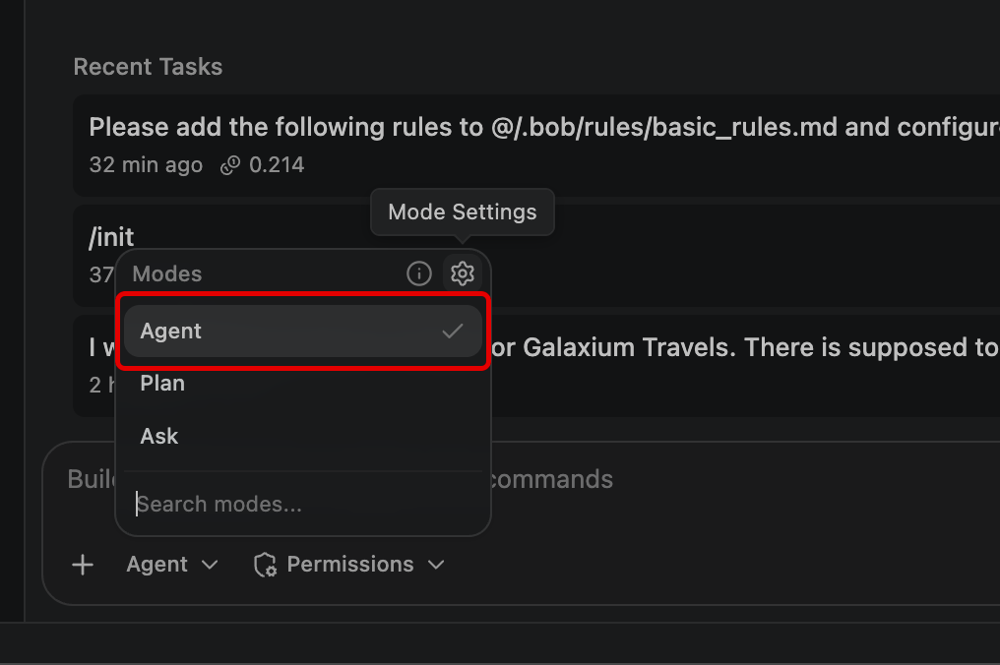

---

2. Click the **cog icon** to expose **Mode Settings**.

    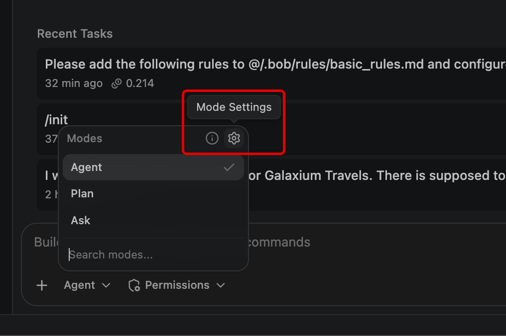

---

3. The *Bob Settings* panel will open. Ensure that the **Modes** tab (left) is selected.

    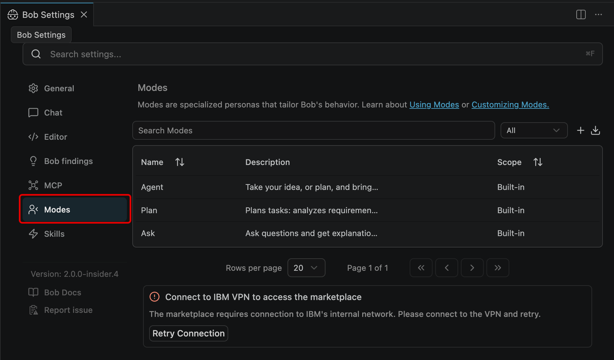

---

4. Click the ++plus++ icon (top-right of the table of existing Modes) to **Create new mode**.

    A new **Create new mode** panel will open within the Bob IDE.

    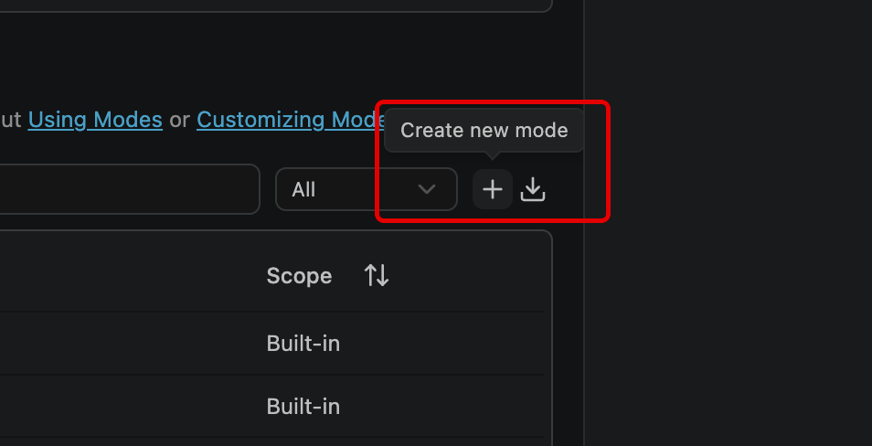

---

5. For the **Slug** field, enter the following:

    ```
    product-manager
    ```

---

6. For the **Name** field, also enter the same details:

    ```
    product-manager
    ```

---

7. For the **Description** field, enter the following:

    ```
    Turns fuzzy ideas into a simple, prioritized product plan with clear outcomes. Creates an MVP scope, user stories, success metrics, and a lightweight roadmap that a team can execute.
    ```

---

8. For the **Scope** field, click the drop-down menu to expose more options. By default this value is set to `Global`.

    **Change** the value to the `galaxium-travels` project.
    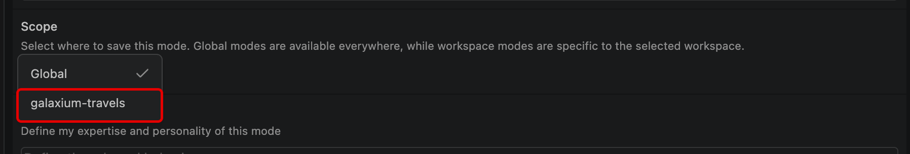


---

9. For the **Role definition** field, enter the following:

    ```
    You are Product Manager Mode. You help define what to build and why. You clarify the user problem, propose an MVP, prioritize work, define success metrics, and produce simple, shareable artifacts (MVP card, roadmap, user stories, risks). You keep it practical and relatable for demos—minimal jargon, fast decisions, explicit tradeoffs.
    ```

---

10. For the **When to use (optional)** field, enter the following:

    ```
    Use this Mode when you need to decide what to build (or build next), define an MVP, create a simple roadmap, write user stories/acceptance criteria, or define success metrics. Not for coding or deep technical architecture.
    ```

---

11. For the **Mode-specific Custom Instructions (optional)** field, enter the following:

    ```
    Start by summarizing the request in 2–3 lines and extract:
    • Target user
    • Problem/pain
    • Desired outcome
    • Constraints (time, scope, dependencies)
    2.	Ask up to 5 clarifying questions max. If answers are missing, make reasonable assumptions and label them clearly.
    3.	Produce these demo-friendly outputs every time (keep each section short):
    • MVP Card: Goal, User, Pain, In Scope (3–6 bullets), Out of Scope (2–4 bullets)
    • Now / Next / Later roadmap (3–5 bullets per column)
    • Top 5 user stories with “Done when…” (2–3 acceptance checks each)
    • Success metrics: 1 Primary, 1–2 Secondary, 1 Guardrail
    • Risks & open questions (2–4 each)
    4.	Make tradeoffs explicit: if something is added to MVP, something else must move to Next/Later.
    5.	End with a single recommended next decision the user should approve (e.g., confirm MVP scope or pick between two options).
    6.	Keep language simple and relatable; avoid framework names unless the user asks (no RICE/PRD jargon by default).
    7.	If helpful, include one small diagram (optional), e.g. a simple flow of the user journey.
    ```

---

12. Now comes the point where you can set limitations on which **Tools** that Bob (and the Custom Mode) are authorized to use.

    **Toggle *ON*** the following from the list of *Available Tools*. All other Tools should be left *off* (default).
    
    - `Read`: Allows Bob to read files in the workspace for this task
    - `Edit`: Allows Bob to edit files in the workspace for this task
    - `MCP`: Allows Bob to use MCP Server tools for this task

    Collectively, these permissions grant the new `product-manager` Custom Mode the ability to read files within the project directory, edit those files, and utilize the open-source Model Context Protocol (MCP).
    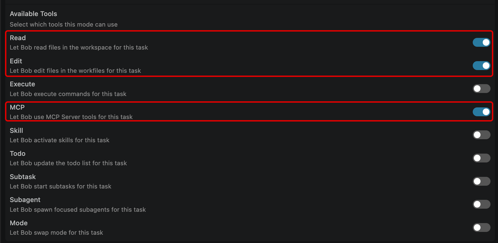

---

13. Finally, press the blue **Save** button (bottom-right corner) to finish defining the `product-manager` Custom Mode.

    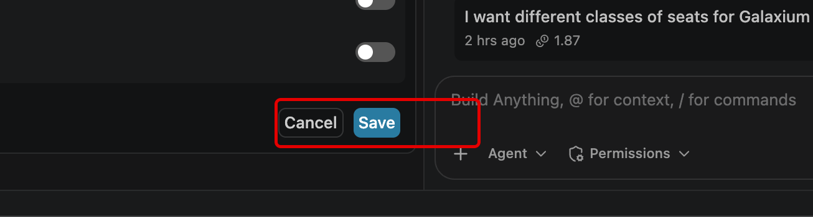

---

14. After saving, you'll be returned to the Modes sub-menu of the *Bob Settings* interface.

    Take note of the new tile for the `product-manager` Custom Mode that has appeared from the list of Modes.
    
    !!! note "Connect to IBM VPN to access the marketplace"
        Connection to the Bob Marketplace opens the doors to a tremendous amount of IBM and IBMer-publised Modes, Skills, and more tools that Bob can directly integrate with as part of its workflow. In order to view and access the Marketplace, ensure that your VPN connection to the IBM intranet is active.
    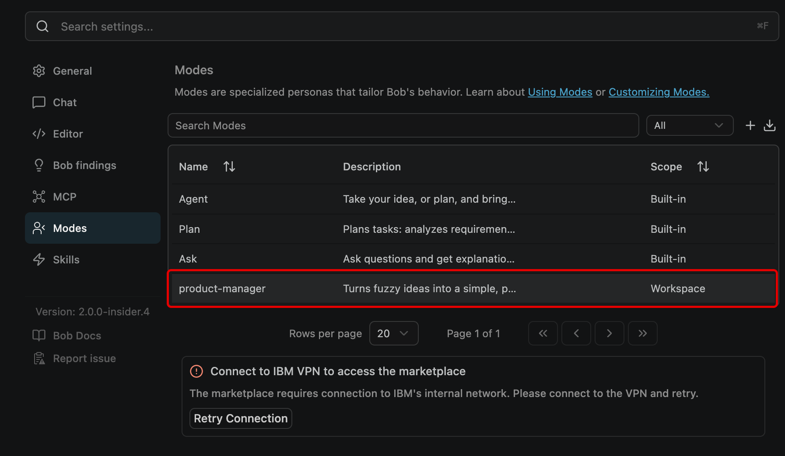

---

15. To the right of the search bar labeled *Search Modes*, click the drop-down marked as **All**.

    From the drop-down options, filter by **Workspace modes**.
    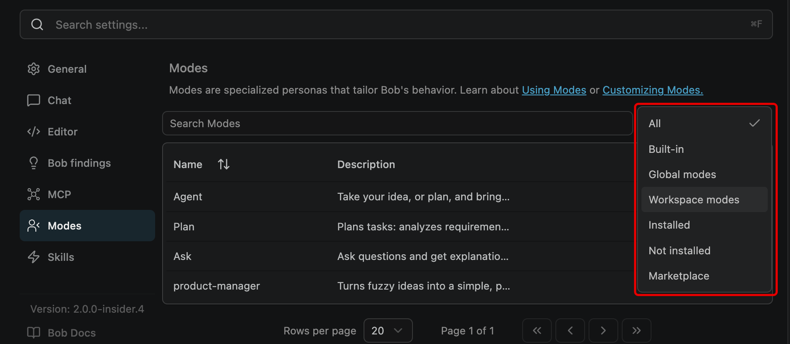

---

16. Within the **Workspace modes** list, the `product-manager` Modes appears alongside its description, confirming that the new Custom Mode was successfully created. These filters can be particularly useful when your Bob project space has accumulated multiple Modes — either ones you've authored yourself, or those that have been installed via the Bob Marketplace.

    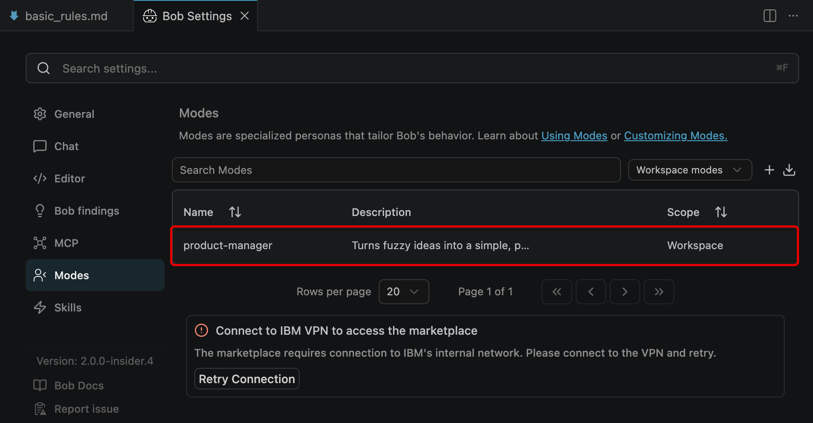

---

17. Return your attention to the **Agentic Sidebar** session on the right side of the Bob IDE.

    Using the **Mode toggle** button, switch into the newly-defined `product-manager` mode.
    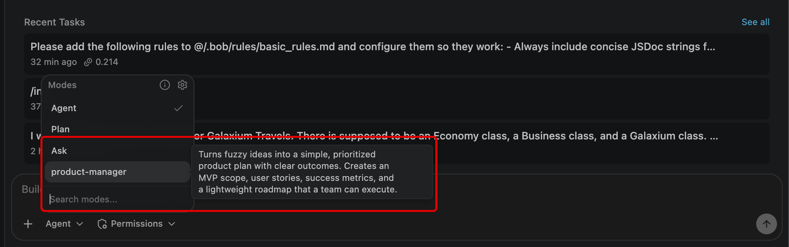

---

18. With the `product-manager` mode activated, copy & paste the following prompt into the session and press ++enter++ to execute.

    ```
    What feature should we build next?
    ```
    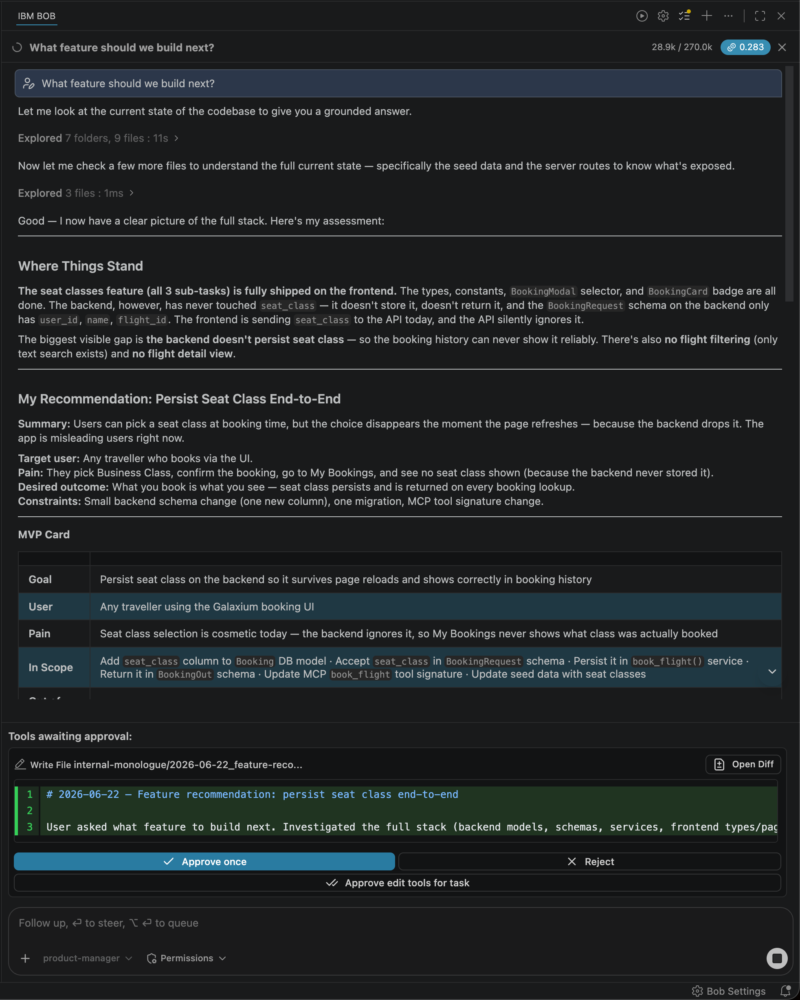

---

**THROUGH THE LENS OF A PRODUCT MANAGER**

As IBM Bob executes upon this ask and does so within the lens of the `product-manager` Mode you just defined, it will generate a detailed report about the current state of the *Galaxium Travels* project. It will first summarize the various functions and purpose of the application, identifying what has been built so far, and what Bob reckons (against its own understanding of such applications and coding best practices) remains missing from a robust and complete version of the service.

***Summary***
Galaxium Travels is a working interplanetary booking app (React + FastAPI + MCP). The last major feature — seat classes (Economy / Business / Galaxium) — was fully shipped across all 6 sub-tasks. The product can now browse flights, register users, book seats by class, cancel, and view history.

***MVP Card***
IBM Bob will define an over-arching goal of the work yet to be done— *"Give travelers a complete post-booking experience — confirmation, trip summary, and smarter flight discovery"* —and then reason out what components of that work should be treated as **In Scope** and **Out of Scope**. The purpose here is defining the immediate, low-hanging opportunities with immediate-to-short-term impacts on users (the **Now** and **Next** categories in the following table, respectively) versus those with longer-term-but-out-of-scope impacts (**Later**).

| NOW | NEXT | LATER |
| --- | ---- | ----- |
| Booking confirmation screen (high visibility, low effort) | Flight search & filter (origin/destination) | Email / notification on booking |
| "My Trip" detail expand in MyBookings | Date-range filtering | User profile page |
| Backend query params for flight filtering | Fare comparison across seat classes (matrix view) | Payment integration |
| Seat class badge in nav | Saved/favourite routes | Multi-passenger booking |

Additional categories like ***Top 5 User Stories***, ***Success Metrics***, ***Risks & Open Questions***, and  ***Recommended Next Decisions*** are also captured within the `product-manager` Mode summary. All of these categories and metrics, of course, are particularly suited to an individual tasked with a Product Manager role in this context!

Continue exploring these details and asking additional prompts within the Agentic Sidebar if you wish, then proceed with the lab guide as we close out with **Module 4**.

---

## **vi. Key takeaways**

---


!!! note ""
    As the **Tailor** module wraps up, take a moment to trace back through your progression along the **AI Maturity Curve**: from conceptualizing IBM Bob as an **Assistant**; to being able to fully **Delegate** critical workloads to Bob; to now fully customizing a **Tailored** Bob workflow that adapts to users and use cases.

    - Custom Modes combine non-deterministic instructions with deterministic tool constraints
    - Tool restrictions are enforced, not suggested (they are the primary safety mechanism for Custom Modes)
    - Rules apply across all Modes (they are not overridden by custom Mode instructions)
    - Modes are created either through the UI or by editing `.bobmodes` directly
    - Project-scoped Modes are stored in `.bobmodes` and are committed to a repository

The final step in the journey— **<a href="https://ibm.github.io/bob-l3/scale/4-1.md" target="_blank">Module 4 | Scale & Extend</a>** —awaits.

---